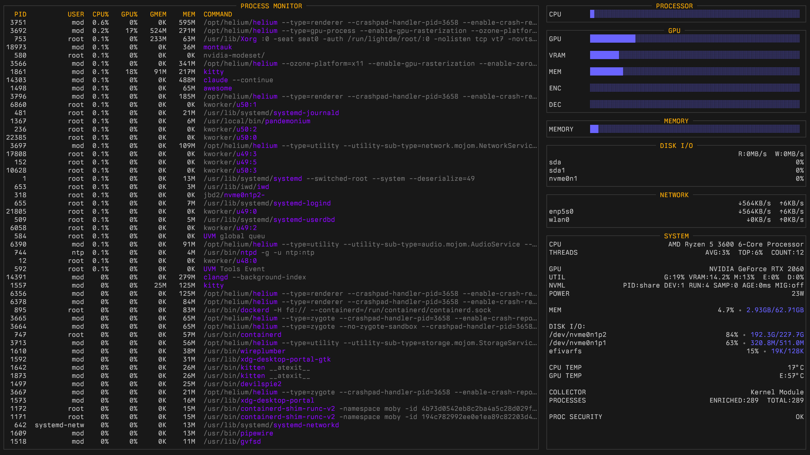
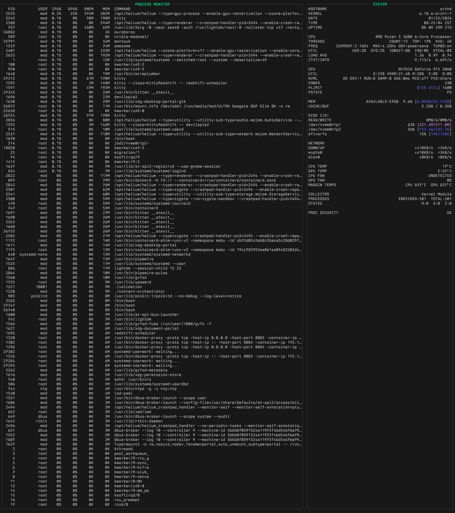

```
███╗   ███╗  ██████╗  ███╗   ██╗ ████████╗  █████╗  ██╗   ██╗ ██╗  ██╗
████╗ ████║ ██╔═══██╗ ████╗  ██║ ╚══██╔══╝ ██╔══██╗ ██║   ██║ ██║ ██╔╝
██╔████╔██║ ██║   ██║ ██╔██╗ ██║    ██║    ███████║ ██║   ██║ █████╔╝ 
██║╚██╔╝██║ ██║   ██║ ██║╚██╗██║    ██║    ██╔══██║ ██║   ██║ ██╔═██╗ 
██║ ╚═╝ ██║ ╚██████╔╝ ██║ ╚████║    ██║    ██║  ██║ ╚██████╔╝ ██║  ██╗
╚═╝     ╚═╝  ╚═════╝  ╚═╝  ╚═══╝    ╚═╝    ╚═╝  ╚═╝  ╚═════╝  ╚═╝  ╚═╝
```

## Overview

A standalone, offline-friendly C++23 system monitor for Linux with comprehensive GPU support, event-driven process monitoring, and Prometheus metrics export. No external dependencies required for the default build.

**Key Features:**
- **Event-Driven Monitoring**: Kernel-based process event tracking with 90%+ reduction in system overhead
- **Deep GPU Integration**: Per-process GPU utilization and memory tracking with intelligent attribution
- **Multi-vendor Support**: NVIDIA (NVML + fallbacks), AMD (sysfs), Intel (fdinfo)
- **Sophisticated Attribution**: Multiple fallback mechanisms for GPU metrics when vendor APIs are unavailable
- **Prometheus Metrics Endpoint**: Optional HTTP `/metrics` endpoint serving Prometheus exposition format over io_uring, enabling integration with Prometheus, Grafana, and Kubernetes monitoring stacks
- **Headless Daemon Mode**: Run without TUI as a pure metrics exporter (`--headless --metrics PORT`)
- **Live Process Search**: Case-insensitive substring filtering with `/` or `Ctrl+F`
- **Thermal Monitoring**: Multi-sensor temperature tracking (edge, hotspot, memory) with vendor-specific thresholds
- **Process Tracking**: Up to 256 processes with full command-line enrichment for accurate identification
- **Atomic Snapshots**: Minimal CPU overhead with lock-free snapshot publication
- **Zero Dependencies**: Builds with standard library only; NVML and liburing auto-detected and optional
- **Churn Resilient**: Real-time churn detection and dynamic display during heavy system activity
- **ANSI Color Support**: Intelligent escape sequence handling with full truecolor support
- **Dynamic Layout**: All panels fill available vertical space automatically
- **Security Monitoring**: Process security analysis with severity-based highlighting
- **Dual Display Modes**: Compact default view and comprehensive SYSTEM focus mode

## Kernel Module (Optional)

For maximum efficiency, montauk includes an optional kernel module (`montauk-kernel`) that eliminates all `/proc` parsing overhead. When loaded, montauk automatically detects and uses it.

**Benefits over userspace collectors:**
- Zero `/proc` reads as data comes directly from kernel `task_struct`
- Zero proc_connector via Netlink traffic event stream as kprobes update the table directly
- Single genetlink call per snapshot; subverts ~3 syscalls per process with /proc, or 1 + N events with proc_connector
- Sub-millisecond process event detection via kprobes
- Background CPU time refresh via kernel workqueue (1Hz)
- ~0.1-0.2% CPU overhead via kernel utilization; ~0.5-1% via proc_connector, ~2-5% via /proc polling

## Screenshots

### Main Interface, Arch Linux


### SYSTEM Interface, Debian Linux


## Installation

### Simple Install

```bash
./install.py
```

### Advanced Install (CMake)

```bash
# Configure
cmake -B build -DCMAKE_BUILD_TYPE=Release

# Build
cmake --build build -j$(nproc)

# Install (optional)
sudo cmake --install build
```

liburing is auto-detected at configure time. If present, the Prometheus metrics endpoint is enabled. If absent, montauk builds without it (no functional impact on the TUI).

### Other Commands

```bash
./install.py build      # Build only, don't install
./install.py clean      # Clean build directory
./install.py uninstall  # Remove installed binary
./install.py test       # Run tests
./install.py --kernel   # Build with kernel module support
./install.py --debug    # Debug build
```

### Arch Linux Package

```bash
makepkg -si   # From PKGBUILD in pkg/ directory
```

**Process Collection Modes:**

montauk supports three collection backends (auto-detected in this priority):

1. **Kernel Module** — Best. Zero /proc reads, zero proc_connector traffic. Requires `montauk.ko` loaded.
2. **Netlink proc_connector** — Good. Receives fork/exec/exit events from kernel, but still reads `/proc/[pid]/*` for process details. Requires `CAP_NET_ADMIN`.
3. **Traditional /proc polling** — Fallback. Scans `/proc` directory each cycle.

To enable netlink proc_connector (when kernel module isn't loaded):
```bash
sudo setcap cap_net_admin=ep /usr/local/bin/montauk
```

Without this capability (and without the kernel module), montauk falls back to traditional /proc scanning.

**Force collector mode** (for testing):
```bash
MONTAUK_COLLECTOR=kernel ./montauk      # Force kernel module (requires montauk.ko)
MONTAUK_COLLECTOR=netlink ./montauk     # Force event-driven (requires capability)
MONTAUK_COLLECTOR=traditional ./montauk  # Force traditional polling
```

**Quick Start:**
```bash
cd montauk-kernel
./install.py
```

This builds the kernel module, installs it, sets up auto-load at boot, and rebuilds montauk with kernel support.

**Verify:**
```bash
lsmod | grep montauk
sudo dmesg | grep montauk
```

**Module Parameters:**
```bash
# Custom settings
sudo modprobe montauk max_procs=4096 debug=1

# Persistent config
echo "options montauk max_procs=4096" | sudo tee /etc/modprobe.d/montauk.conf
```

| Parameter | Default | Description |
|-----------|---------|-------------|
| `max_procs` | 8192 | Maximum processes to track |
| `debug` | false | Enable verbose kernel logging |

**Unload:**
```bash
sudo rmmod montauk
```

See `montauk-kernel/README.md` for full documentation including architecture, protocol specification, and troubleshooting.

## Operating Modes

montauk supports three operating modes via composable CLI flags:

```bash
montauk                                # TUI only (default, unchanged)
montauk --metrics 9101                 # TUI + Prometheus endpoint on :9101
montauk --headless --metrics 9101      # Daemon mode: Prometheus only, no TUI
montauk --headless                     # Error: "nothing to do"
```

**Prometheus Metrics Endpoint:**

When `--metrics PORT` is specified, montauk serves Prometheus exposition format (text/plain; version=0.0.4) at `http://localhost:PORT/metrics`. The endpoint reads from the same lock-free SnapshotBuffers the TUI uses -- no mutexes, no additional overhead. All socket I/O is driven by io_uring.

Exported metric families (~55 gauges, all prefixed `montauk_`):
- CPU: aggregate, per-core, user/system/iowait/irq/steal breakdown, context switches, interrupts
- Memory: total/used/available/cached/buffers/swap (bytes), utilization percent
- Network: per-interface and aggregate rx/tx bytes/sec
- Disk: per-device read/write bytes/sec, utilization percent, aggregate totals
- Filesystem: per-mount total/used/available bytes, utilization percent
- Processes: total/running/sleeping/zombie counts, thread count
- Per-process top-N: CPU%, resident memory, GPU utilization, GPU memory (labeled by PID and command)
- GPU: per-device VRAM, temperatures, fan speed; aggregate VRAM, utilization, encoder/decoder, power

Requires liburing at build time. Without liburing, montauk compiles normally with the metrics endpoint disabled.

## UI Controls

**Navigation:**
- `q` — Quit
- `↑/↓` — Scroll process list
- `PgUp/PgDn` — Page up/down

**Search/Filter:**
- `/` or `Ctrl+F` — Enter search mode (live case-insensitive substring filter)
- `Enter` — Confirm filter and return to normal mode
- `Esc` — Exit search mode (or clear active filter from normal mode)
- `Backspace` — Delete last character (empty backspace exits search mode)

**Sorting:**
- `c` — Sort by CPU%
- `m` — Sort by Memory
- `g` — Sort by GPU%
- `v` — Sort by GPU Memory (GMEM)
- `p` — Sort by PID
- `n` — Sort by Name

**Display Toggles:**
- `G` — Toggle GPU panel
- `t` — Toggle Thermal panel
- `d` — Toggle Disk I/O panel
- `N` — Toggle Network panel
- `h` — Toggle help line

**Modes:**
- `s` — Toggle SYSTEM focus mode (shows detailed system information in right column)
- `i` — Toggle CPU scale (machine-share ↔ per-core)
- `u` — Toggle GPU scale (capacity ↔ utilization)
- `R` — Reset UI to defaults
- `+/-` — Increase/decrease refresh rate

**Note:** In SYSTEM focus mode, the right column displays comprehensive system metrics including CPU, GPU, memory, disk, network, thermal, and process statistics. Default mode shows individual panels (PROCESSOR, GPU, MEMORY, DISK I/O, NETWORK, SYSTEM).

## Configuration

- `MONTAUK_MAX_PROCS` — Maximum number of processes tracked and rendered in the Process Monitor (default: `256`). Set to `1024` for deeper lists. Valid range: `32–4096`.
- `MONTAUK_ENRICH_TOP_N` — Number of top processes to enrich with full command line and user name (default: `MONTAUK_MAX_PROCS`, up to 4096). All tracked processes are enriched by default for accurate GPU process detection.

Notes:
- With the kernel module, enrichment has zero /proc overhead (cmdline comes from kernel). With userspace collectors, enrichment reads `/proc/[pid]/cmdline` and `/proc/[pid]/status` which is the primary cost. Reduce `ENRICH_TOP_N` below `MAX_PROCS` if needed for lower-powered systems without the kernel module.
- Both variables accept either `MONTAUK_…` or `montauk_…` prefixes.

## CPU Scale Modes

**Machine-share (default):**
- 100% = entire machine's CPU capacity
- Processes sum naturally toward total system usage
- Best for understanding system-wide resource consumption

**Per-core (IRIX-style):**
- 100% = one full CPU core
- Multi-threaded apps can exceed 100%
- Toggle with `i` key

## GPU Support

### NVIDIA

**Full NVML Integration** (recommended):
- Per-process GPU utilization (SM, encoder, decoder)
- Per-process VRAM usage
- Device-level metrics (util, power, temps, clocks)
- MIG mode detection
- PRIME render offload support

**Requirements:**
- Runtime: `nvidia-utils` (provides `libnvidia-ml.so.1`). montauk now loads NVML dynamically and does not require dev headers.
- Optional build: `cuda` headers if you opt-in to static NVML linkage via CMake.

**Fallback Chain** (when NVML unavailable or insufficient):
0. NVML (runtime loader) — Preferred when available
1. Device-level via `nvidia-smi --query-gpu=…` — Name, VRAM, GPU/MEM util, temp, pstate, power
2. `nvidia-smi pmon` — Per-process utilization sampling
3. `nvidia-smi --query-compute-apps` — Compute context memory
4. `/proc/driver/nvidia/gpus/*/fb_memory_usage` — Device VRAM
5. Heuristic distribution based on device-level metrics

### AMD/Intel

- `/sys/class/drm` — VRAM usage, temperatures, power
- `/proc/*/fdinfo` — Per-process GPU utilization (DRM)
- `gpu_busy_percent` — Device utilization

### Browser GPU Process Detection

montauk automatically identifies browser GPU processes (Chrome, Chromium, Helium, etc.) by:
- Scanning for `--type=gpu-process` in command lines
- Enriching up to 256 processes with full cmdline data
- Applying intelligent fallback attribution when processes use minimal CPU
- Using `/proc/*/fd` device file inspection for decode-only workloads

### GPU Environment Variables

```bash
MONTAUK_NVIDIA_PMON=0     # Disable nvidia-smi pmon fallback (default: 1)
MONTAUK_NVIDIA_MEM=0      # Disable nvidia-smi memory query (default: 1)
MONTAUK_LOG_NVML=1        # Enable NVML debug logging
MONTAUK_NVIDIA_SMI_DEV=0  # Disable device-level nvidia-smi fallback (default: 1)
MONTAUK_NVIDIA_SMI_PATH=/usr/bin/nvidia-smi  # Override nvidia-smi path
MONTAUK_SMI_MIN_INTERVAL_MS=1000             # Min interval between device-level SMI queries
MONTAUK_GPU_DEBUG=1       # Log active GPU backend (nvml/smi/drm) to stderr
MONTAUK_DISABLE_NVML=1    # Disable runtime NVML loader
MONTAUK_NVML_PATH=/usr/lib/x86_64-linux-gnu/libnvidia-ml.so.1  # Override NVML lib path
```

## Display Details

**Process Columns:**
- **PID** — Process ID
- **USER** — Owner username
- **CPU%** — CPU utilization (0-100% in machine-share, 0-N×100% in per-core)
- **GPU%** — GPU SM/compute utilization
- **GMEM** — GPU memory (VRAM) usage
- **MEM** — System RAM usage
- **COMMAND** — Process name or full command line

**Minimum Display Values:**
- CPU% and GPU% show **0.1%, 0.2%, etc.** for sub-1% activity
- Values 1% and above shown as integers
- This ensures low-activity processes remain visible without inflating their usage

**UI Layout:**

**Default Mode:**
Left column: PROCESS MONITOR (dynamically fills available height)
Right column (top to bottom):
- PROCESSOR (CPU utilization bar)
- GPU (multi-metric bars: GPU util, VRAM, MEM util, ENC, DEC)
- MEMORY (RAM utilization bar)
- DISK I/O (throughput and device stats)
- NETWORK (throughput and interface stats)
- SYSTEM (detailed system information)

**SYSTEM Focus Mode (press 's'):**
Left column: PROCESS MONITOR
Right column: Comprehensive SYSTEM box showing:
- Host/kernel/date/time/uptime (when in SYSTEM focus)
- CPU details (model, threads, frequency, governor, turbo, utilization breakdown)
- Load averages
- Context switches and interrupts per second
- GPU info (model, utilization, NVML status, power, power limit, P-state)
- Memory (available, used, cache/buffers)
- Disk I/O (aggregate and per-device)
- Network (aggregate and per-interface)
- Filesystem usage
- CPU and GPU temperatures with margin-to-warning calculations
- Collector type (Kernel Module, Netlink proc_connector, or Traditional)
- Process counts (enriched vs total)
- System threads statistics
- Process states (Running, Sleeping, Zombie)
- **PROC CHURN** (when active) or **PROC SECURITY** (when no churn)

**Color Coding:**
- Normal text: Default terminal color
- Bars: Green (healthy) → Yellow (caution) → Red (warning) based on utilization
- CAUTION severity: Yellow/orange highlighting (60-80% default)
- WARNING severity: Red highlighting (80%+ default)
- PROC CHURN: CAUTION severity (yellow/orange)
- PROC SECURITY warnings: Severity-based coloring (INFO/CAUTION/WARNING)
- Borders and titles: Configurable accent colors

## Churn Handling

During heavy system activity (builds, installs, rapid process creation), `/proc` and `/sys` entries can vanish between directory scans and file reads. This affects userspace collectors (netlink proc_connector and traditional /proc polling). The kernel module is immune to /proc churn since it reads `task_struct` directly.

montauk handles churn gracefully with dynamic visual feedback:

**PROC CHURN Display:**

When active churn is detected, the SYSTEM box shows:
- Summary line: `PROC CHURN  N events [LAST 2s]` (colored as CAUTION - yellow/orange)
- Event breakdown: `PROC:X  SYSFS:Y` showing source of churn events
- Currently affected processes with PIDs (processes may have exited by display time)

**Display Behavior:**
- PROC CHURN and PROC SECURITY are mutually exclusive
- When churn is active: PROC CHURN replaces PROC SECURITY display
- When churn subsides: PROC SECURITY returns automatically
- In SYSTEM focus mode: Churn details dynamically fill available vertical space

**Process Table:**
- Churned processes may show partial metrics during read failures
- Clears on next successful sample
- System remains responsive throughout churn events

Example SYSTEM box during churn:
```
PROC CHURN                                  8 events [LAST 2s]
PROC:8  SYSFS:0
PID:12345 cc1plus
PID:12346 ld
PID:12347 as
```

The event count (8) may exceed visible PIDs (3) because some processes exit before display update.

## Configuration (Environment Variables)

### UI/Terminal
```bash
MONTAUK_ALT_SCREEN=0           # Disable alt screen (default: 1)
MONTAUK_TITLE_HEX=#FFB000      # Title color (hex, truecolor terminals)
MONTAUK_TITLE_IDX=214          # Title color (palette index, fallback)
MONTAUK_ACCENT_IDX=11          # Accent color (default: 11, cyan)
MONTAUK_CAUTION_IDX=9          # Caution color (default: 9, bright red)
MONTAUK_WARNING_IDX=1          # Warning color (default: 1, red)
```

**Color Configuration:**
- `_HEX` values use truecolor (24-bit) format when terminal supports it
- `_IDX` values use 256-color palette indices (0-255)
- Environment variables override built-in defaults
- Both `MONTAUK_` and `montauk_` prefixes accepted

### Colors/Thresholds
```bash
MONTAUK_PROC_CAUTION_PCT=60    # Process caution threshold (default: 60%)
MONTAUK_PROC_WARNING_PCT=80    # Process warning threshold (default: 80%)
```

Colors are configured via the UI/Terminal section above.

### Alerts
```bash
MONTAUK_TOPPROC_ALERT_FRAMES=5  # Frames before top-proc alert (default: 5)
                                 # Lower = more sensitive, higher = sustained load only
```

### Process Display
```bash
MONTAUK_PROC_CPU_SCALE=total   # Default CPU scale: total|core
MONTAUK_COPY_FRONT=1           # Snapshot copy for concurrency safety (default: 1)
```

### Thermal Thresholds

**Dynamic (preferred):**
- NVIDIA: Auto-discovered via NVML (slowdown, mem_max)
- AMD/Intel: Auto-discovered via sysfs hwmon (crit, max, emergency)

**Overrides:**
```bash
# Generic CPU/GPU
MONTAUK_CPU_TEMP_WARNING_C=90
MONTAUK_CPU_TEMP_CAUTION_C=80
MONTAUK_GPU_TEMP_WARNING_C=90
MONTAUK_GPU_TEMP_CAUTION_C=80
MONTAUK_TEMP_CAUTION_DELTA_C=10   # Default offset when only warning known

# GPU per-sensor overrides
MONTAUK_GPU_TEMP_EDGE_WARNING_C=85
MONTAUK_GPU_TEMP_EDGE_CAUTION_C=75
MONTAUK_GPU_TEMP_HOT_WARNING_C=95
MONTAUK_GPU_TEMP_HOT_CAUTION_C=85
MONTAUK_GPU_TEMP_MEM_WARNING_C=95
MONTAUK_GPU_TEMP_MEM_CAUTION_C=85

# Display thresholds inline
MONTAUK_SHOW_TEMP_WARN=1          # Show warning temps on thermal lines
```

### Testing/Development
```bash
MONTAUK_PROC_ROOT=/custom/proc    # Remap /proc paths (userspace collectors only)
MONTAUK_SYS_ROOT=/custom/sys      # Remap /sys paths
MONTAUK_COLLECTOR=kernel          # Force kernel module (fails if montauk.ko not loaded)
MONTAUK_COLLECTOR=netlink         # Force netlink proc_connector (fails if no CAP_NET_ADMIN)
MONTAUK_COLLECTOR=traditional     # Force traditional /proc polling
```

## Testing

**Build with tests:**
```bash
cmake -S . -B build -DMONTAUK_BUILD_TESTS=ON
cmake --build build -j
./build/montauk_tests
```

When built with liburing, this includes Prometheus serializer tests (CPU gauge, memory byte conversion, per-core labels, top-N process output, empty snapshot safety).

**Self-test mode:**
```bash
./build/montauk --self-test-seconds 5
```

**Stress Testing:**

montauk includes stress test scripts in the companion `stress-tests/` directory for validating monitoring accuracy and churn detection:

**GPU Stress Test:**
```bash
cd ../stress-tests
./stress_test 60        # 60-second GPU + CPU stress test
```
- Tests GPU utilization tracking (compute + memory)
- Multi-threaded CPU load (OpenMP)
- VRAM allocation monitoring
- Power and thermal tracking

**PROC CHURN Test:**
```bash
./proc_churn.sh 30 100  # 30 seconds, 100 processes/second
```
- Rapidly spawns and destroys processes
- Triggers PROC CHURN detection (userspace collectors only; kernel module is immune)
- Tests /proc resilience during heavy activity
- Validates collector behavior differences

Monitor with montauk while running stress tests (press 's' for SYSTEM focus to see detailed churn metrics).

**Note:** Tests are disabled by default in packaging builds.

## Uninstall (CMake)

```bash
sudo xargs rm -v < build/install_manifest.txt
```

## Packaging (Arch Linux)

- PKGBUILD provided in `pkg/` directory
- NVML auto-detected at build time
- Build deps: `cmake`, `gcc`, `make`
- Optional build: `liburing` (enables Prometheus metrics endpoint)
- Optional runtime: `nvidia-utils`
- Tests disabled by default: `MONTAUK_BUILD_TESTS=OFF`

**Install:**
```bash
makepkg -si
```

**Result:** `/usr/bin/montauk`

## Architecture

**Collectors:**
- `CpuCollector` — Per-core usage, freq, model, governor, turbo status
- `MemoryCollector` — RAM, swap, buffers, cache, available memory
- `KernelProcessCollector` — Kernel module backend via genetlink (preferred)
- `NetlinkProcessCollector` — Event-driven via proc_connector + /proc reads (fallback 1)
- `ProcessCollector` — Traditional /proc scanning (fallback 2)
- `GpuCollector` — VRAM, temps, power, utilization (multi-vendor)
- `GpuAttributor` — Per-process GPU util/mem with fallback chains
- `NetCollector` — Interface stats, throughput (down/up per interface)
- `DiskCollector` — I/O stats, throughput, per-device utilization
- `ThermalCollector` — Multi-sensor temps with vendor thresholds
- `FsCollector` — Filesystem usage (mountpoint, used, total)
- `FdinfoProcessCollector` — Per-process GPU metrics via /proc/*/fdinfo (DRM)

**Core Components:**
- `Security` — Process security analysis (privilege escalation, suspicious patterns)
- `Churn` — Real-time /proc and /sysfs churn event tracking
- `Alerts` — Process-based alerting system
- `SnapshotBuffers` — Lock-free snapshot management
- `Producer` — Coordinated data collection pipeline
- `Filter` — Process filtering and sorting
- `TimSort` — TimSort with pattern detection and galloping mode
- `MetricsServer` — io_uring HTTP server for Prometheus endpoint (optional, requires liburing)
- `PrometheusSerializer` — Serializes MetricsSnapshot to Prometheus text exposition format via `std::to_chars()`

**UI Components:**
- `Panels` — Right column rendering (PROCESSOR, GPU, MEMORY, DISK I/O, NETWORK, SYSTEM)
- `ProcessTable` — Left column PROCESS MONITOR rendering with severity coloring
- `Renderer` — Frame composition and terminal output with ANSI escape handling
- `Terminal` — TTY detection, color support, cursor control
- `Formatting` — Text layout, truncation with ANSI-escape-aware functions
- `Config` — Theme loading, environment variable parsing

**Process Collection:**

montauk supports three collection backends (auto-selected by availability):

**Kernel Module — Preferred:**
- All data from kernel `task_struct` via genetlink
- Kprobes hook fork/exec/exit directly
- Background workqueue refreshes CPU times at 1Hz
- Zero /proc reads, zero proc_connector overhead
- Requires `montauk.ko` loaded

**Netlink proc_connector — Fallback 1:**
- Subscribes to kernel process events (fork, exec, exit) via proc_connector
- Still reads `/proc/[pid]/stat`, `/proc/[pid]/cmdline`, etc. for process details
- Sub-millisecond event detection, but /proc reads add overhead
- Requires `CAP_NET_ADMIN` capability

**Traditional /proc polling — Fallback 2:**
- Scans `/proc` directory every sample interval
- Maintains compatibility when neither kernel module nor netlink available
- Identical functionality and UI to other modes

**Snapshot Pipeline:**
1. Collectors sample independently
2. Atomic snapshot publication via lock-free double buffer
3. GpuAttributor enriches with per-process GPU data
4. TUI renders from stable snapshot (seqlock copy for concurrency)
5. MetricsServer reads from the same SnapshotBuffers via selective seqlock (bounded, fixed-size copy)

**GPU Attribution Logic:**
1. NVML per-process queries (preferred)
2. `nvidia-smi pmon` parsing
3. `/proc/*/fdinfo` DRM stats
4. Heuristic distribution from device metrics
5. Residual VRAM attribution to clear GPU processes
6. `/proc/*/fd` device inspection for decode workloads

## Performance

- **Overhead:** ~0.1-0.2% CPU with kernel module, ~0.5-1% with netlink proc_connector, ~2-5% with /proc polling
- **Sampling:** 500ms default (adjustable with +/-)
- **Process limit:** 256 default, configurable up to 4096 (top by CPU usage)
- **Process detection:** Sub-millisecond with kernel module or netlink, ~1 second with /proc polling
- **System calls:** 1 per snapshot (kernel module), ~1 + N events (netlink), ~3 per process (/proc polling)
- **Cmdline enrichment:** All tracked processes up to 4096 (full command lines for accurate GPU detection)
- **Memory:** ~10MB resident

**Technical Implementation:**

**ANSI Escape Sequence Handling:**
- Display width calculations skip escape codes (don't count as visible characters)
- String truncation preserves embedded ANSI codes
- Prevents double-coloring and escape sequence corruption
- Full truecolor (24-bit) support with 256-color fallback

**Dynamic Layout:**
- All panels calculate available vertical space dynamically
- PROCESS MONITOR fills to match terminal height
- SYSTEM box expands to fill remaining space
- PROC CHURN and PROC SECURITY details fill all available lines
- No hardcoded row limits

**Churn Detection:**
- Tracks /proc and /sysfs read failures in sliding 2-second window
- Event counts tracked separately by source (PROC vs SYSFS)
- Per-process churn flag for processes with read failures
- Auto-clears when churn subsides
- Zero performance impact when no churn active

**TimSort with Galloping Mode:**

Process table sorting uses a C++23 TimSort implementation (`src/util/TimSort.cpp`) with pattern detection and galloping mode:

- **O(n) Pattern Detection:** Single-pass analysis before sorting:
  - `AlreadySorted` — Instant return, no work needed
  - `Reversed` — O(n) in-place reversal
  - `NearlySorted` — Delegates to `std::stable_sort` (< 5% inversions)
  - `Random` — Full TimSort with run detection and galloping merges

- **Galloping Mode:** Exponential search optimization for clustered data:
  - `gallop_left` / `gallop_right` — Find insertion points in O(log k) where k is distance from hint
  - Pre-merge trimming eliminates entire merges when blocks don't overlap
  - Adaptive threshold (MIN_GALLOP=7) — Backs off when galloping doesn't pay off
  - Ideal for process data: sequential PIDs, idle/active CPU clusters

- **Verified to Kernel Limits:**
  - Tested with 10M elements; scales to any process count the kernel allows (`pid_max` caps at 4M)
  - Disjoint PID blocks: 90% fewer comparisons vs std::stable_sort
  - CPU%-sorted data: 73% fewer comparisons
  - Random data: Tested with `getrandom()` syscall for cryptographic randomness; no regression vs std::stable_sort

- **Stability Guarantee:** Maintains relative order of equal elements (critical for consistent UI when processes have identical CPU%)

## Policy

**No external dependencies** for default build. NVML and liburing are auto-detected and gracefully disabled when unavailable. No vendoring, no FetchContent, no ExternalProject.

## License

MIT License. See LICENSE file in repository.
