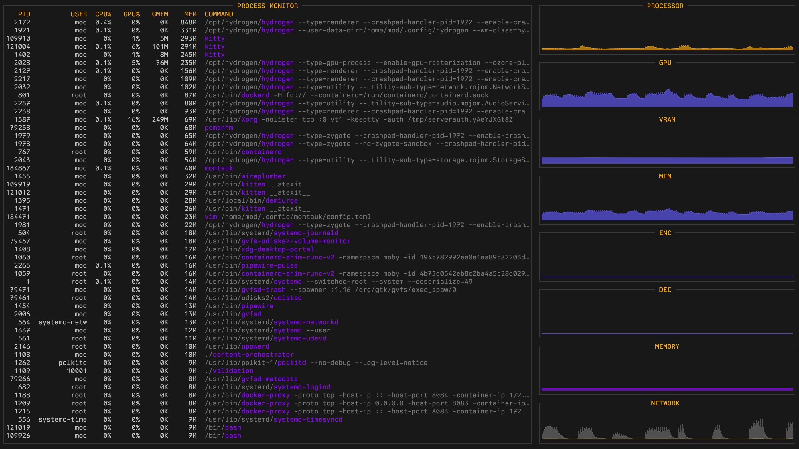
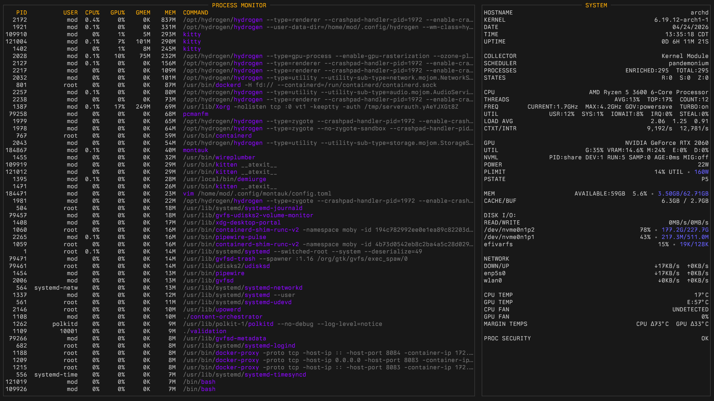
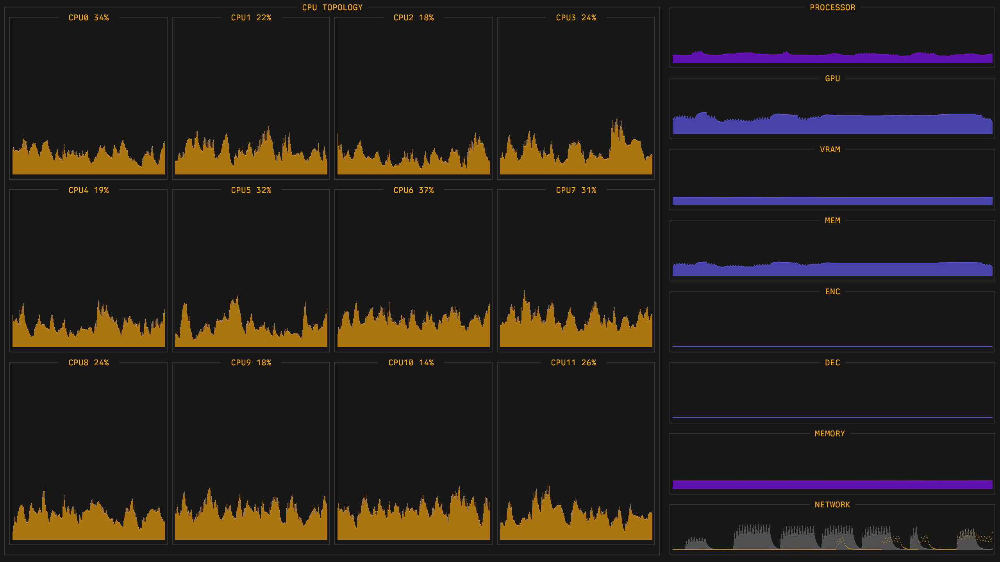

```
███╗   ███╗  ██████╗  ███╗   ██╗ ████████╗  █████╗  ██╗   ██╗ ██╗  ██╗
████╗ ████║ ██╔═══██╗ ████╗  ██║ ╚══██╔══╝ ██╔══██╗ ██║   ██║ ██║ ██╔╝
██╔████╔██║ ██║   ██║ ██╔██╗ ██║    ██║    ███████║ ██║   ██║ █████╔╝ 
██║╚██╔╝██║ ██║   ██║ ██║╚██╗██║    ██║    ██╔══██║ ██║   ██║ ██╔═██╗ 
██║ ╚═╝ ██║ ╚██████╔╝ ██║ ╚████║    ██║    ██║  ██║ ╚██████╔╝ ██║  ██╗
╚═╝     ╚═╝  ╚═════╝  ╚═╝  ╚═══╝    ╚═╝    ╚═╝  ╚═╝  ╚═════╝  ╚═╝  ╚═╝
```

montauk is a Linux observability platform in one statically-linked C++23 binary: An event-driven monitor, an eBPF flight recorder and an offline analyzer, built on sublimation, its in-tree sort, search and learn core.

## Overview

The monitor attributes CPU, multi-vendor GPU, thermal and PMU cost to individual processes in real time and renders pixel-perfect area charts over the Kitty graphics protocol. The tracer (`--trace`) is an eBPF flight recorder over a whole process tree, event-driven discovery with no ptrace: Per-thread syscalls and scheduler decisions with wake-to-run latency, sync-object contention, heap traffic, signals, file I/O and hardware counters through `perf_event_open`, at near-zero overhead into a binary log. The analyzer (`montauk_analyze` / `montauk_trace_decode`) folds a 450 MB capture once into 27 single-pass diagnostic reports and cross-run population statistics, no live target and no privileges. Every surface, the TUI, the Prometheus endpoint and structured JSON, renders from one typed result, provably consistent and enforced by byte-identical golden gates: A script or an agent reads exactly the data the human report shows. That result is enriched, not just measured: The classical-ML core scores each process for anomaly on the live snapshot, and vector, montauk's agent-facing MCP server, serves it over stdio JSON-RPC through seven read-only tools, three that return conclusions rather than metrics.

**sublimation** is montauk's in-tree sort, search and learn core: A disorder-classified sort that measures the structure an input already carries and routes it to the algorithm that structure earns, sorting 100 million random int64 at ~17 ns/element under the AVX2 comparison-sort floor; a tri-face matcher (literal, regex, fuzzy k-mismatch) at or above the Rust regex crate on real corpora; and a classical-ML core in three lanes (anomaly detectors, a graph-spectral engine, an FFT and signal-residual lane), pure algorithm with zero downloaded weights. The process table's ordering, the analyzer's rankers, the latency-structure classification its reports read and all of montauk's text matching run through it; the `sublimation` CLI exposes the same engine as a shell command with grep-exact exit codes. No system packages, no fetch step, no libc qsort or std::sort in shipped code; NVML and liburing are auto-detected and optional, everything else lives in the repo.

## Components

| Tool | Invocation | Role |
|---|---|---|
| **monitor** | `montauk` | Event-driven TUI. Per-process CPU and multi-vendor GPU attribution (NVIDIA NVML + `nvidia-smi` fallbacks, AMD sysfs, Intel fdinfo), thermal margins, security findings, live search (literal, regex, fuzzy) and disorder classification. Cell-clipped UI, pixel-rendered area charts (Kitty `t=t` /dev/shm transport, Sixel fallback), three column-swappable views. Optional Prometheus `/metrics` over io_uring, hourly `.prom` logging and a one-shot `--json` snapshot. |
| **tracer** | `montauk --trace PATTERN` | eBPF flight recorder over a whole process tree: Event-driven discovery, no ptrace, no `/proc`. Per-thread state and syscalls, ntsync / futex / keyed-event sync, heap traffic, signals and aborts, file I/O, file-backed mmap, scheduler decisions with wake-to-run latency, CCX-bucketed migrations and hardware PMU counters via `perf_event_open`. Composes with `--metrics`, `--log` and a near-zero-overhead binary log (`--trace-out`). |
| **analyzer** | `montauk_analyze`, `montauk_trace_decode` | Folds a capture once into single-pass diagnostic reports (27 of them, from `waits` and `doublefree` to `dispatch-stall` and `fractal`) over logs reaching 450 MB+, plus recording-directory digests and cross-run population statistics. No live target, no privileges. |
| **sublimation** | in-tree core + `sublimation` CLI | montauk's sort, search and match core, used everywhere: The process table, every ordering the analyzer emits, the structure classification its reports read and all of montauk's text matching. The CLI exposes the same engine as a complete stream-processing surface: Statistics, structure, text and relational operations, with grep-exact exit codes. See [sublimation](#sublimation-an-adaptive-sort-search-and-learn-core). |
| **vector** | `components/vector/target/release/vector` | Agent-facing MCP server: Stdio JSON-RPC 2.0, a separate static Rust binary, zero third-party crates. Seven read-only tools, three of them returning conclusions rather than metrics: `montauk_anomalies` (ranked, explained anomalies over the live process population), `montauk_similar` (behavioral nearest by effective resistance) and `montauk_regime` (did the load regime shift, and when), beside `montauk_snapshot`, `montauk_analyze_report`, `montauk_digest` and `sublimation` (direct FFI, no subprocess per call). See [vector](#vector-the-agent-facing-tool-surface). |

The kernel module (`montauk-kernel`), the external-metrics provider sockets and `vector` are the only seams to the outside; everything else is one statically-linked C++23 binary. sublimation ships in the same tree with its own tests: One license, one README for both.

## sublimation: An adaptive sort, search and learn core

sublimation is **an adaptive sort, search and learn core**, vendored in-tree under `montauk/sublimation/` (source, the `sublimation` CLI, tests). The sort is disorder-classified: It measures what structure an input already carries (runs, rotation, sampled inversions, a distinct-value estimate, the phase boundary, the Young-tableau shape via patience sorting) and routes every input to the algorithm its structure earns, from a no-op through an O(n) reverse, counting sort, run-merge, rotation fix and binary insertion up to the AVX2 PCF-bucketed quicksort pipeline for random data. At 100 million random int64: **~17 ns/element, under the AVX2 comparison-sort floor**, while sorted input costs a scan and equal keys stay stable by construction through a packed-index tiebreak. Beside the sort sits one text-matching engine with three faces (literal, regex, fuzzy k-mismatch), dispatched by pattern shape, its regex face **at or above the Rust `regex` crate on several corpora** (byte-parity-gated) and a fuzzy face no standard library ships. Beside both sits the classical-ML core: Three lanes of pure-algorithm learning (anomaly detectors, a graph-spectral engine, an FFT/signal-residual lane) that turn telemetry into conclusions. One core for everything montauk sorts, searches, measures or learns from.

| Component | Function |
|---|---|
| **disorder classifier** | one O(n) pass → the verdict: `sorted` / `reversed` / `nearly-sorted` / `few-unique` / `phased` / `random` / `spectral`. The analyzer's `sched` report reads it to label a latency timeline's structure. |
| **run-merge tree** | merges structured runs smallest-boundary-gap-first through a union-find, so the cheapest joins happen while the data is hottest |
| **index sorts** | order a `uint32_t` index array by a numeric key without moving rows (32-bit key packed with its index into one `uint64_t`; 64-bit key carried as a stable LSD-radix satellite) |
| **string sort** | prefix-pack + MSD-radix, for the process-name column |
| **structural locator** | slides the classifier across a stream to find *where* a disorder pattern sits (`locate`) |
| **randomness battery** | eight entropy lenses (hook-length entropy, LIS vs `2√n`, inversion ratio, distinct ratio, horizontal-visibility degree, ordinal permutation entropy, RQA determinism, spectral flatness on the comparison Laplacian) fused as confidence = (1 − 2⁻ᵏ) × meet, with a typed verdict: Max-entropy / consistent / mixed / structured (`rand`). RQA catches deterministic chaos (the logistic map) that every counting and ordinal lens reads as random. |
| **matcher** | text search, one engine, three faces: Literal/anchor (data-relative rare-byte prefilter), regex (Glushkov bit-parallel field + lazy-DFA reach cache + literal prefilter), fuzzy k-mismatch (pigeonhole prefilter). Classify-dispatch picks the face. Backs `search` and all of montauk's text matching. |
| **value search** | `select` (quickselect) and `searchsorted` (binary, lower/upper bound) |
| **field** | N-th delimited column projection, awk's `{print $N}` |
| **learn lane** | pure-algorithm, zero-weight anomaly detectors over a feature matrix: Robust MAD modified-z (with a mean-absolute-deviation fallback so a constant column does not go blind), EWMA residual, squared Mahalanobis through a  Cholesky and streaming Half-Space Trees. Fused two at a time, this is the classical-ML face montauk enriches its snapshot with. |
| **spectral lane** | a cyclic-Jacobi symmetric eigensolver, effective resistance (the commute-time graph distance) through the Laplacian pseudoinverse, the Fiedler value with a spectral-gap partition count and Ng-Jordan-Weiss spectral clustering over a  Lloyd k-means. Backs `montauk_similar`. |
| **signal lane** | a  radix-2 FFT and the Spectral Residual saliency detector built on it, a weight-free shape-anomaly detector over a time series. Backs `montauk_regime`. |

The matcher is byte-parity-gated against independent oracles on every face: Python `re` for regex, a brute k-mismatch reference for fuzzy, a position checksum for the anchor. It replaced the Boyer-Moore-Horspool + Thompson-NFA port in v8.0.0.

**How it works.** Classification is one O(n) pass (run count, monotone runs, max descent gap); only ambiguous inputs pay for sampled inversions, distinct-value estimation and the full Young-tableau shape via patience sorting. The hook-length formula (Frame-Robinson-Thrall) gives the information-theoretic comparison bound, and the tableau shape routes: Counting sort for few-unique (k ≤ 64), the run-merge tree for structured runs, an O(n) rotation fix for rotated-sorted, binary insertion for low-displacement nearly-sorted, a prefix/suffix merge for phased and for random data a four-layer pipeline: PCF bucketing → AVX2/BMI2 block quicksort → pdqsort fat-pivot → AVX2 sorting networks at the leaves. Both regime-detection sites (the sort's partition-quality watch and the classifier's phase-boundary detection) run one second-order critically-damped oscillator primitive: Damping 1/8, spring 1/128, zeta ≈ 0.707, a dead-banded energy reservoir and Schmitt park/release. EWMA and CUSUM are retired from shipped code as of v8.0.0; they survive only in tests, as oracles. When the oscillator flags sustained partition degradation, a genuine spectral fallback takes the range: A real graph Laplacian over sampled comparisons, cyclic Jacobi eigendecomposition and Fiedler seriation, gated to int64 at n in [64, 512]. Type-generic across i32/i64/u32/u64/f32/f64; IPS4o-style parallel sort at n ≥ 250K. No libc qsort anywhere in the library or CLI: The generic qsort-compatible shim was removed at ABI v3, the keyed sort rides the stable pack index sort and the string-sort fallback paths run an in-house allocation-free introsort.

**On the command line.** The `sublimation` CLI puts the engine a shell pipe away. Numeric commands read a value stream (`--field N` pulls a delimited column, folding in awk's extraction): Order and quantiles, k-th selection and value lookup, the reductions (`sum`/`mean`/`min`/`max`/`count`, `stdev`/`variance`), disorder classification, a randomness verdict and `characterize`, the structural verdict that names a stream's disorder class, its randomness and its exploitable structure. `search`, `field` and `where` are the line tools; `group` is datamash / SQL `GROUP BY`, `describe` the one-shot pandas summary, `histogram` the shape, `outliers` the robust Tukey-fence flag; `replace` is `sed s/pat/repl/g` on the same matcher; `intersect`/`subtract`/`union`/`join` are the two-stream relational lane; `locate --values` is select-by-structure (keep the part of the stream that *is* sorted, random or phased); `uniq`/`cut`/`column`/`tac`/`paste`/`head`/`tail` fill out coreutils and `distinct`/`tally` are `sort | uniq [-c]`.

| Command | Operation |
|---|---|
| `sublimation sort [--desc] [--keyed]` | order ascending / descending; `--keyed` keeps the whole line, ordering by the key (`--field N` or the whole line), coreutils' `sort -k` with stable ties |
| `sublimation quantile Q [--nearest]` | the Q-quantile (Q in 0..1); `--nearest` for the nearest-rank order statistic |
| `sublimation select K` | the K-th smallest (0-based) |
| `sublimation searchsorted V` | insertion index of V in the sorted input |
| `sublimation sum \| mean \| min \| max` | reductions over the value stream, awk's `{s+=$N}` family |
| `sublimation stdev \| variance` | sample (n−1) standard deviation / variance |
| `sublimation count [--words\|--bytes]` | line / word / byte count, `wc -l/-w/-c` |
| `sublimation head N` / `tail N` | first / last N lines |
| `sublimation describe \| histogram \| outliers` | pandas-style summary, 10-bin text histogram, Tukey-fence outliers |
| `sublimation classify` | disorder class + profile of the stream |
| `sublimation locate CLASS [--values]` | the windows where a disorder pattern sits; `--values` emits the data in them |
| `sublimation rand` | randomness confidence from the eight-lens battery |
| `sublimation characterize` | the structural verdict: Disorder class, randomness confidence, sort efficiency |
| `sublimation search PATTERN [FILE..]` | matching lines from stdin or files; regex by default, `-F` fixed string, `-k N` fuzzy k-mismatch |
| `sublimation replace PAT REPL` | global per-line regex substitution, `sed s/pat/repl/g` |
| `sublimation field N,M [--delim D]` | the N-th column, or a comma-list, awk's `{print $N}` and `{print $1,$3}` |
| `sublimation where 'N OP V'` | lines whose field N satisfies the numeric predicate, awk's `$N OP V` |
| `sublimation group KEY OP [VAL]` | group by field KEY, aggregate field VAL (`sum`/`mean`/`count`/`min`/`max`), datamash `-g` |
| `sublimation uniq \| cut \| column \| tac \| paste -s` | the coreutils line idioms |
| `sublimation distinct \| tally` | distinct-token count / per-token frequency, `sort \| uniq [-c]` |
| `sublimation intersect \| subtract \| union \| join` | the two-stream relational lane |

`search` carries the full grep working set: `-F`/`-E`/`-k N` pick the face, `-i` and `-S` (smart case) handle casing, `-v`/`-c`/`-n`/`-o`/`-q`/`-m N` shape output, `-A`/`-B`/`-C` add context, `-w`/`-x` anchor to words or whole lines, `-e PAT`/`-f FILE` build multi-pattern sets, `-l`/`-L` name files with or without a match, `-H`/`-h`/`--label` control the filename prefix, `-s` silences unreadable-file messages, `-a`/`-I` set binary-file handling, `--color=auto|always|never` highlights, `--line-buffered` flushes per line and `--files-from LIST` reads input paths from a list (`find ... -print0 | sublimation search PAT --files-from -`). That last flag is the traversal affordance: Native directory walking deliberately stays with grep and rg, by the division-by-target rule below. Exit codes are grep's contract exactly: 0 matched, 1 nothing, 2 unreadable input. The whole surface is byte-verified against GNU grep and coreutils in a 74-case parity gate plus an exit-code oracle.

For example: `cat dump | sublimation quantile 0.99 --field 2` for a column's 99th percentile, `ps aux | sublimation where '6 > 100000'` to keep the heavy processes, `seq 1 1000 | shuf | sublimation characterize` to name a stream's shape. The division is by **target**: sublimation owns the stream (the column, filter, reduce, order and structure idioms) while `grep`, `find` and `awk` keep filesystem traversal and the awk language itself.

**On the shell.** Nothing requires the pipe to name `sublimation` outright: A few `~/.bashrc` wrapper functions can route the stream forms of `grep`, `sort`, `wc`, `awk`, `cut`, `tac`, `paste`, `sed`, `head`, `tail` and `datamash` to it, so `awk '{print $1,$3}'`, `cut -f2 -d,` or `sed 's/foo/X/g'` resolve to `field`, `cut` or `replace`. The awk language proper (`BEGIN`/`END`, `NF`/`NR`, variables, `printf`, control flow) stays awk's; the wrappers route only the byte-for-byte idioms and rely on sublimation's grep-exact exit codes to keep shell conditionals correct.

**Performance** (AMD Ryzen 5 3600, Zen 2, `-O2 -march=native`, powersave governor, ns/element at 100K, best of 5; the harness is in-tree at `sublimation/tests/bench/`, driven by `bench-sublimation.py` with C, Rust and Go comparators):

| Pattern | sublimation | introsort | qsort | Rust ipnsort |
|---|--:|--:|--:|--:|
| sorted | 0.2 | 6.1 | 25.3 | 0.3 |
| pipe_organ | 3.4 | 55.1 | 28.7 | 17.0 |
| few_unique | 14.5 | 18.6 | 54.8 | 2.7 |
| phased | 23.9 | 52.3 | 102.9 | 15.9 |
| random | 23.7 | 51.6 | 102.4 | 19.4 |

sublimation beats libstdc++ introsort on 7/8 patterns and glibc qsort on 8/8 (1.3-65×); it trails Rust ipnsort (the AVX2 comparison-sort floor) on uniform random by only ~1.2× on this Zen 2 part and leads it on sorted / equal / pipe-organ / nearly-sorted. The same AVX2+BMI2 paths the Zen 3 reference runs; no AVX-512 on either. String sort runs 2.0-4.5× over `qsort + strcmp`.

**Random-data size sweep** (same machine, ns/element, best of 5; 100M best of 3, sortedness-validated): The comparison sorts pay an O(n log n) tax at every step while the learned PCF pipeline stays ~flat. The gap to Rust ipnsort closes through 100K, **crosses ahead at 1M and holds the lead clear out to 100 million**; no L2 cliff, the dynamic-B bucketing stays flat across a 100× range.

| n | sublimation | introsort | qsort | Rust ipnsort |
|---|--:|--:|--:|--:|
| 1K | 24.9 | 30.7 | 62.7 | 8.4 |
| 10K | 21.7 | 41.2 | 83.5 | 11.8 |
| 100K | 23.1 | 51.4 | 102.4 | 14.6 |
| 1M | **15.6** | 61.3 | 123.7 | 17.5 |
| 10M | 16.6 | 71.2 | 143.2 | 20.1 |
| 100M | **17.6** | 80.8 | 163.7 | 21.8 |

From 1M to 100M sublimation holds ~16-18 ns/element while Rust ipnsort rises 17.5 → 21.8 and introsort and qsort rise faster still: The linear PCF pipeline pulling away from the O(n log n) comparison floor as n grows. At **100 million** random int64, sublimation sorts **1.24× faster than Rust ipnsort** (the AVX2 comparison-sort floor), **4.6× over introsort** and **9.3× over glibc qsort**.

**Search performance** (same machine, MB/s on 4 MB corpora, higher is better). The harness is in-tree at `sublimation/tests/search/bench/`: Seeded deterministic corpora, median-of-9, with C, C++, Go, Rust-std and Rust-regex comparators, byte-parity-gated against Python `re`, a brute k-mismatch oracle and a position checksum. The regex face against the Rust `regex` crate (ripgrep's engine, SIMD Teddy + lazy DFA) and Go `regexp` (RE2 lineage):

| Pattern | sublimation | Rust regex crate | Go regexp |
|---|--:|--:|--:|
| `MARK[A-Z]R` | **61.4k** | 56.9k | 52.9k |
| `A[CG]TT` | **276** | 242 | 44 |
| `str[a-z]ct` | 1.7k | 4.8k | 469 |

A scalar bit-parallel field competitive with the Rust regex crate: Ahead of it where a rare byte lets the prefilter skip (`MARK[A-Z]R`) or the lazy-DFA reach cache carries a dense low-literal pattern (`A[CG]TT`), behind it only on common-literal `str[a-z]ct` where its SIMD literal prefilter beats the scalar anchor (the one standing gap, scalar vs SIMD, a stated non-goal). Ahead of Go `regexp` across the board, and well ahead of Python `re`, C++ `std::regex` and POSIX. **Fuzzy k-mismatch is a face no standard library ships**: `SIGKILL` k=1 at **10.8k MB/s**, 12× the brute baseline via the pigeonhole prefilter.

**The classical-ML core.** Beyond sort and search, sublimation contains a third face: Three lanes of classical machine learning, pure algorithm, zero downloaded weights. The learn lane scores anomalies over a feature matrix (MAD modified z-score, EWMA, Cholesky-based Mahalanobis, Half-Space Trees); the spectral lane runs a cyclic-Jacobi eigensolver, effective resistance through the Laplacian pseudoinverse and Ng-Jordan-Weiss clustering; the signal lane is a radix-2 FFT and the Spectral Residual detector on it. Every lane is byte-parity-gated against numpy the way the matcher is against GNU grep: Eigenvalues to 1e-8, effective resistance exact against the numpy pseudoinverse, Spectral Residual byte-exact, Half-Space Trees byte-identical to a splitmix64-shared reference. montauk reads them to conclude rather than report.

**Lineage.** Influenced by flow-model research (Kyng-Dinic maximum flow, spectral graph theory); the lineage survives in the spectral fallback, the graph-spectral learn lane (effective resistance as commute-time distance, Ng-Jordan-Weiss clustering) and the adaptive-control primitives. The rest of the family tree: Robinson-Schensted correspondence (sorting ↔ Young tableaux), TimSort (the run-adaptive lineage; the prior C++ TimSort/Powersort implementation is archived out of tree), Thompson's NFA construction (the prior regex engine, retired in v8.0.0 for the Glushkov field), Fiedler spectral seriation (Atkins-Boman-Hendrickson), the classical-ML detectors (Iglewicz-Hoaglin robust z, Tan-Ting-Liu Half-Space Trees, Ren et al. Spectral Residual), CoDel and damped-oscillator adaptive control and AlphaDev-shaped AVX2 sorting networks. Full citations in [References](#references).

**Build.** Compiled as a static library with montauk. Requires a Haswell-or-newer CPU (BMI2 + AVX2) and gcc 13+ (C23).

**Where montauk uses it:** the process-table sort and the analyzer's orderings (latency quantiles, report rows, struct-by-key sorts via `sublimation_order_*`, value lookups via `searchsorted`); the `sched` report's structure classification and locator; and all of montauk's text matching (kernel-thread classification, the live `/`-search, `--trace` token matching). montauk's C++ carries zero `std::sort`, `std::stable_sort` or `std::nth_element` call sites; every ordering routes through sublimation.

## vector: The agent-facing tool surface

vector is a stdio JSON-RPC 2.0 server exposing montauk and sublimation to any MCP-speaking agent: A single static Rust binary, zero third-party crates, the same no-dependency stance as the rest of the tree. It registers with an MCP client with no venv, no interpreter resolution and no PATH entry to go stale:

```
claude mcp add --scope project montauk -- components/vector/target/release/vector
```

Seven tools, read-only and observational only (no killing processes, no scheduler-policy changes, nothing mutating, stated explicitly in every tool description). Three return conclusions rather than metrics: What is anomalous, what behaves like a given process and what shifted.

| Tool | Wraps | Function |
|---|---|---|
| `montauk_anomalies` | `montauk --json` + learn lane | ranks the live process population by a fused MAD + Mahalanobis anomaly score and returns the top processes with the dominant feature axis and a plain-language note |
| `montauk_similar` | `montauk --json` + spectral lane | the processes behaving like a given one: A standardized feature vector per process, an RBF affinity graph, ranked by effective resistance (commute-time distance) FFI'd out of the spectral lane |
| `montauk_regime` | `/proc/stat` + signal lane | did the machine's load regime shift recently, and when: Samples aggregate CPU over a short window and runs Spectral Residual to locate shifts, each with how many seconds ago |
| `montauk_snapshot` | `montauk --json` | one-shot structured snapshot of live system state |
| `montauk_analyze_report` | `montauk_analyze FILE --report ... --json` | diagnostic reports over a trace file as the structured JSON envelope |
| `montauk_digest` | `montauk_analyze DIR --digest --json` | compact specs + stability + thermal + offenders digest over a recording directory |
| `sublimation` | direct FFI into `libsublimation.a` | sort / classify / search, no subprocess spawn per call |

The three conclusion tools do their math through `extern "C"` bindings into the learn, spectral and signal lanes of the same static library `montauk_core` and `montauk_analyze` already link, so the classical-ML core runs in-process with zero spawn cost; `montauk_snapshot`, `montauk_analyze_report` and `montauk_digest` wrap the standalone `montauk` and `montauk_analyze` processes, and `montauk_regime` reads `/proc/stat` directly, the same source montauk itself reads, because a one-shot snapshot carries no history.

Four substantive source files plus glue: `rpc.rs` (a hand-rolled JSON-RPC 2.0 loop over stdio; stdout carries protocol messages only, all logging goes to stderr), `json.rs` (a  JSON parser and serializer; `include/util/json.h` is write-only by design, so this is the first thing in montauk that reads JSON), `ffi.rs` (the bindings, linked via `build.rs` against `libsublimation.a`) and `tools.rs` (the tool registry, dispatch and JSON Schemas). `main.rs`/`lib.rs` are the wrapper and module glue.

**Build.** `cd components/vector && cargo build --release`. No CMake target; a separate build tree beside the C++ binary, the same pattern the kernel module (`components/kernel`) uses.

## Screenshots

### Main Interface


Default view. PROCESS MONITOR on the left; pixel-rendered area charts (PROCESSOR, GPU, VRAM, GPU MEM, ENC, DEC, MEMORY, NETWORK) stacked on the right. Charts emit through Kitty's `t=t` /dev/shm transport (Sixel fallback) and update at 1 Hz over a 60-second rolling window.

### SYSTEM Focus (`s`)


`s` swaps the right-column chart stack for a text panel: Identity (hostname, kernel, uptime), runtime (collector, scheduler, process states), CPU (model, threads, freq/governor, load avg, ctxt-sw rate), GPU (model, util, NVML, power, p-state), memory, disk I/O, network, thermal margins and process-security findings, severity-colored in place.

### CPU Topology (`Shift+C`)


`Shift+C` swaps PROCESS MONITOR for a dynamic grid of bordered boxes, one per logical CPU, each rendering a pixel-rasterized area chart of that core's recent utilization (60s default, `[chart] history_seconds`) with live util% centered on the top border. Grid columns auto-fit the rect; high-core-count systems fall into scroll mode at minimum cell height. Same monotone-cubic AA rasterizer and Kitty/Sixel emit path as the right-column charts; the right column is unaffected by the toggle.

## Installation

### Simple Install

```bash
./install.py
```

### Advanced Install (CMake)

```bash
cmake -B build -DCMAKE_BUILD_TYPE=Release
cmake --build build -j$(nproc)
sudo cmake --install build   # optional
```

liburing is auto-detected at configure time and enables the Prometheus metrics endpoint; without it montauk builds normally with the endpoint disabled.

### Other Commands

```bash
./install.py build      # Build only, don't install
./install.py clean      # Clean build directory
./install.py uninstall  # Remove installed binary
./install.py test       # Run tests
./install.py --kernel   # Build with kernel module support
./install.py --debug    # Debug build
```

### Arch Linux Package

```bash
makepkg -si   # From the PKGBUILD at the repo root
```

### Process Collection

montauk auto-detects the best available backend, in this priority:

| backend | mechanism | requires | CPU overhead | event detection | syscalls per snapshot |
|---|---|---|---|---|---|
| **kernel module** | genetlink read of the in-kernel table; kprobes update it directly, workqueue refreshes CPU times at 1 Hz; zero `/proc` reads, zero netlink event traffic | `montauk.ko` loaded | ~0.1-0.2% | sub-millisecond | 1 |
| **netlink proc_connector** | fork/exec/exit events from the kernel, `/proc/[pid]/*` reads for details | `CAP_NET_ADMIN` | ~0.5-1% | sub-millisecond | ~1 + N events |
| **/proc polling** | scans `/proc` each cycle; identical functionality and UI | nothing | ~2-5% | ~1s | ~3 per process |

To enable netlink proc_connector when the kernel module isn't loaded:
```bash
sudo setcap cap_net_admin=ep /usr/local/bin/montauk
```

Force a backend for testing:
```bash
MONTAUK_COLLECTOR=kernel ./montauk       # requires montauk.ko
MONTAUK_COLLECTOR=netlink ./montauk      # requires the capability
MONTAUK_COLLECTOR=traditional ./montauk  # /proc polling
```

## Operating Modes

montauk composes its modes from CLI flags:

```bash
montauk                                # TUI only (default)
montauk --metrics 9101                 # TUI + Prometheus endpoint on :9101
montauk --log /var/log/montauk         # TUI + Prometheus-format log files
montauk --log /var/log/montauk --log-interval-ms 5000  # Custom write interval (default: 1000ms)
montauk --headless --metrics 9101      # Daemon mode: Prometheus only, no TUI
montauk --headless --log /var/log/montauk              # Daemon mode: logging only
montauk --headless --metrics 9101 --log /var/log/montauk  # Daemon mode: both
montauk --headless                     # Error: requires --metrics or --log
montauk --trace firefox                # Trace mode: per-thread diagnostics for process group
montauk --trace myapp --metrics 9101   # Trace mode + Prometheus endpoint
montauk --trace myapp --log /tmp/trace # Trace mode + flight recorder
montauk --trace myapp --trace-out t.bin # Trace mode + raw binary event log
montauk --trace myapp --trace-out t.bin --sched-detail  # + per-switch scheduler detail
montauk --trace myapp --stream-out /dev/ttyS1  # Second binary stream to a character device
montauk_trace_decode t.bin             # Decode a binary log to text (--csv for CSV)
montauk_analyze t.bin --report waits   # Run an analysis report over a binary log
montauk --json                         # One-shot structured system snapshot (JSON), then exit
montauk_analyze t.bin --json           # Emit the diagnostic reports as one JSON envelope
montauk --init-theme                   # Detect terminal palette, write config.toml
```

**Prometheus Metrics Endpoint:**

With `--metrics PORT`, montauk serves Prometheus exposition format (text/plain; version=0.0.4) at `http://localhost:PORT/metrics`. The endpoint reads the same lock-free SnapshotBuffers the TUI uses: No mutexes, no additional overhead. io_uring drives all socket I/O (requires liburing at build time).

Exported metric families (~55 gauges, all prefixed `montauk_`): CPU aggregate and per-core with user/system/iowait/irq/steal breakdown, context switches and interrupts; memory (bytes and percent); per-interface and aggregate network throughput; per-device disk throughput and utilization; per-mount filesystem usage; process state counts; per-process top-N CPU, resident memory, GPU utilization and GPU memory (labeled by PID and command); per-device GPU VRAM, temperature, fan, power and encoder/decoder load.

**Log Writer:**

With `--log DIR`, montauk writes timestamped Prometheus exposition snapshots to disk, rotating hourly as `montauk_YYYY-MM-DD_HH.prom`, each block prefixed with a `# montauk_scrape_timestamp_ms` comment for replay. The LogWriter reads the same SnapshotBuffers; it works independently of or alongside `--metrics`.

**Structured JSON (`--json`):**

Both the monitor and the analyzer emit their state as JSON, so an agent or a script consumes montauk without scraping the TUI or parsing prose.

- `montauk --json` prints one structured snapshot of live system state and exits. It warms two producer cycles so the rate deltas (context switches, network and disk throughput) are real, then serializes system specs, CPU (with per-core), PMU, memory, GPU, thermal, network, disk, filesystems and the ranked top processes as one JSON object. No TUI, no server, no daemon. Paired with `--trace PATTERN`, a second JSON-lines record follows with the live trace snapshot (threads, migrations, ntsync, fds, sched-op counts), one shared walk with the Prometheus renderer so the two surfaces cannot drift apart on a field.
- `montauk_analyze FILE --json` emits the diagnostic reports as one JSON envelope: A `schema_version`, the trace context (path, pattern, event count, format version, start time) and a `reports` array, each report carrying its verdict, typed findings, gauges (with the same help text the Prometheus export uses) and offenders.

The JSON is a renderer, not a second computation. Every report computes a typed result once; the text, Prometheus and JSON surfaces all render from that one result, so they cannot disagree on a number. A byte-identical corpus gate freezes the `json` surface and a per-report parity pass verifies identical gauges in text and JSON (see [Testing](#testing)). The writer is one in-tree serializer (`include/util/json.h`, ~140 lines, no third-party dependency); montauk only ever writes JSON, never parses it.

**Trace Mode (eBPF):**

With `--trace PATTERN`, montauk runs headless and attaches BPF programs to kernel tracepoints (`sched_process_fork/exec/exit`, `raw_syscalls sys_enter/exit`, `sched_switch`, `sched_wakeup`, `signal_deliver`, scheduler-decision tracepoints and per-syscall tracepoints for fd and mmap tracking) and to libc uprobes (heap allocation, the abort path). No `/proc` scanning, no text parsing, no TOCTOU races.

Discovery is event-driven with zero userspace roundtrip on the critical path. The pattern lives in a BPF array map and matches in-kernel, case-insensitively, at four points: The `sched_process_exec` handler (against the exec'd filename and `task->comm`), a process's first syscall (catches `clone()` without `exec()`), `prctl(PR_SET_NAME)` (catches processes that rename themselves) and `sched_process_fork` (children of a tracked parent auto-track; the parent is tracked before it can fork, so children are never missed). Userspace rescan remains as a fallback for edge cases. If no matching process is running, montauk waits for one; it excludes its own process chain. This works for any process model on Linux: Thread pools, container runtimes, daemons that rename themselves.

Per-thread capture: Thread state (R/S/D/T/Z) from `sched_switch`; the current syscall with decoded arguments; on-CPU time; open fds via the openat/close/socket/eventfd2 tracepoints; file I/O (`read`/`write`/`lseek`/`pread64`/`fstat` with fd, byte count, offset and return value); futex ops with op/val/uaddr for wait/wake correlation; heap traffic (`malloc`/`free`/`realloc`/`calloc` via uprobes, size paired with address, realloc moves tracked); signals with a user-mode stack snapshot, abnormal-exit postmortem stacks and the libc abort path (`__assert_fail`/`__libc_message`/`abort`); file-backed mmap (anonymous mappings filtered); scheduler decisions (enqueue / pick / preempt / wakeup / wake-to-run latency, bound by generic role to whatever decision tracepoints the active scheduler exposes; montauk names no scheduler in source); per-thread core and migration counts bucketed intra / cross / unknown-CCX against a sysfs-derived L3-domain map; and ntsync (Wine/Proton NT synchronization ioctls with the waited-on object fds). Scheduler decisions aggregate per-CPU by default (one counter increment, near-zero overhead); `--sched-detail` opts into the heavy per-switch stream (per-CPU idle boundaries, the EEVDF pick fallback) that the placement, slice and stall reports need, at ~6× cost on CPU-cycling workloads.

Trace mode composes with `--metrics` and `--log`: The Prometheus endpoint appends the trace families alongside the system metrics, and the hourly `.prom` files become a flight recorder. The families: `montauk_trace_process_info`, `_thread_state`, `_thread_cpu_percent`, `_thread_syscall`, `_thread_io`, `_fd_target`, `_thread_cpu`, `_thread_migrations`, `_migrations_intra_ccx`/`_cross_ccx`/`_unknown_ccx`, `_ntsync`, `montauk_sched_op_total{op}`, the `montauk_pmu_*` gauges (below) and the group-metadata gauges (`montauk_trace_group_size`, `_thread_total`, `_waiting`).

The trace subsystem runs as a parallel pipeline with its own lock-free seqlock double buffer, independent of the main monitoring pipeline. BPF programs maintain per-thread state maps in the kernel; userspace reads them every 500ms to publish snapshots. Zero `/proc` reads after attach. No impact on the TUI or system metrics when `--trace` is not used.

Runtime requires root (`CAP_SYS_ADMIN` on most configurations). Build requires `libbpf`, `bpftool` and `clang` (BPF target), auto-detected by CMake; if unavailable, `--trace` prints an error.

**Binary Event Log (`--trace-out`):**

The periodic Prometheus snapshot carries aggregate per-thread state. For high-rate event streams (scheduler decisions, heap traffic), formatting each event to text at trace time is a syscall-per-event firehose that perturbs the workload being measured. `--trace-out FILE` writes the raw ring records verbatim, batched into ~256 KB writes (one syscall per batch); trace-time cost per event drops to a memcpy. The header captures `CLOCK_MONOTONIC` and `CLOCK_REALTIME` anchors at trace start, so readers reconstruct absolute wall-clock per event and correlate against external logs. `--stream-out DEVICE` opens a second, independent stream in the same format, meant for a character device (a qemu-backed serial port), so capture survives a hang that takes `--trace-out`'s filesystem down with it. Both are independent of `MONTAUK_TRACE_VERBOSE` (the per-event stderr aid) and `--log` (the Prometheus flight recorder). The offline tools that read the log are covered under [Trace Analysis Tools](#trace-analysis-tools).

**Hardware Performance Counters (PMU):**

Trace mode additionally samples hardware counters via `perf_event_open`: Per-CPU L2 cache misses/references (AMD Zen raw events), instructions, cycles, context switches, CPU migrations, branch misses and, where the `amd_uncore` module exposes the `amd_l3` PMU, per-CCX L3 accesses/misses. Derived rates (IPC, L2 miss percent, cycles-per-L2-miss, per-second rates) export as the `montauk_pmu_*` gauges. The `amd_l3` event encoding comes entirely from sysfs; nothing is hardcoded but the documented Zen2 fallback. This is the cache-placement signal that pairs with the CCX-migration counters: Misses explain why cross-CCX moves hurt.

On the same recording stream montauk derives the efficiency picture from sysfs: Package power from the powercap RAPL counters (`montauk_power_watts`), a wrap-safe cumulative package energy (`montauk_package_energy_joules_total`, whose delta is the digest's window-integral energy), average CPU frequency (`montauk_cpu_frequency_mhz_avg`), per-state idle residency (`montauk_cstate_residency_percent{state}`) and energy-per-instruction (`montauk_energy_per_instruction_pj`). One capture carries temperature, power, clock, idle depth, scheduler churn and the efficiency they imply.

PMU sampling requires `kernel.perf_event_paranoid <= 0` or `CAP_PERFMON` and is exclusive to trace mode by design; the plain monitor never calls `perf_event_open`. If the permission check fails, PMU is disabled with a one-line notice and tracing continues.

**External Metrics Providers:**

montauk ingests external programs' own metrics. `ProviderCollector` scrapes unix sockets named `<name>.sock` in `$XDG_RUNTIME_DIR/montauk/providers/` (fallback `/run/montauk/providers/`): Connect, read one full Prometheus-text snapshot to EOF. Providers self-identify by socket filename; montauk names none in source, and a missing directory or unreachable provider is a silent per-scrape no-op. Provider text passes through montauk's Prometheus exposition verbatim and embeds into the binary trace stream as provider-snapshot records, so a capture carries the external program's self-reported state inline with the kernel events. Export-only: Not shown in the TUI.

## UI Controls

**Navigation:** `q` quits; `↑/↓` scrolls the process list; `PgUp/PgDn` pages.

**Search/Filter:** `/` or `Ctrl+F` enters live case-insensitive substring filtering; `Enter` confirms, `Esc` exits (or clears an active filter from normal mode); `Backspace` deletes (empty backspace exits).

**Sorting:** `c` CPU%, `m` Memory, `g` GPU%, `v` GPU Memory, `p` PID, `n` Name.

**Modes and toggles:**
- `s` toggles SYSTEM focus (right column: Chart stack ↔ text panel)
- `C` (Shift+C) toggles the CPU TOPOLOGY grid (left column; arrows and PageUp/PageDown scroll on high-core systems; `Esc` or `C` returns). The two column toggles are independent.
- `i` toggles CPU scale: Machine-share (100% = the whole machine, processes sum toward system usage) ↔ per-core IRIX-style (100% = one core, multi-threaded apps exceed 100%)
- `u` toggles GPU scale (capacity ↔ utilization)
- `G` toggles the GPU charts (util / VRAM / GPU MEM / ENC / DEC)
- `t` toggles the Thermal section inside SYSTEM focus
- `R` resets the UI; `+/-` adjusts the refresh rate

**Help overlay:** `?` or `h` opens it. The overlay loads `man montauk` at runtime and renders it inside the PROCESS MONITOR column, reflowing to the available width via `MANWIDTH`; edit `montauk.1` and the overlay updates on next open. While open: `j`/`k` scroll, `d`/`Space` page down, `u` page up, `g`/`G` jump, `q`/`?`/`Esc` close.

## Configuration

montauk reads a unified TOML file at `~/.config/montauk/config.toml`, resolving each value TOML → `MONTAUK_*` environment variable → compiled default; no file means compiled defaults at zero overhead. `montauk --init-theme` writes a starter with your terminal's 16-color palette detected. The full schema (`[palette]`, `[roles]`, `[thresholds]`, `[ui]`, `[process]`, `[nvidia]`, `[keybinds]`), the process-collector settings and the complete `MONTAUK_*` reference live in [`CONFIG.md`](CONFIG.md). The process columns, two-column layout and severity color coding are documented in [`CONFIG.md`](CONFIG.md#display-details).

## GPU Support

### NVIDIA

Full NVML integration (recommended): Per-process GPU utilization (SM, encoder, decoder), per-process VRAM, device-level metrics (util, power, temps, clocks), MIG detection and PRIME render offload. Runtime needs `nvidia-utils` (`libnvidia-ml.so.1`); montauk loads NVML dynamically, no dev headers required. Static NVML linkage is an optional CMake opt-in via the `cuda` headers.

When NVML is unavailable or insufficient, montauk walks a fallback chain: Device-level `nvidia-smi --query-gpu=…`, `nvidia-smi pmon` per-process sampling, `nvidia-smi --query-compute-apps` for compute memory, `/proc/driver/nvidia/gpus/*/fb_memory_usage` for device VRAM, then heuristic distribution from device-level metrics.

### AMD/Intel

`/sys/class/drm` for VRAM, temperatures and power; `/proc/*/fdinfo` (DRM) for per-process utilization; `gpu_busy_percent` for device utilization.

### Browser GPU Process Detection

montauk identifies browser GPU processes (Chrome, Chromium, Helium, etc.) by scanning for `--type=gpu-process` in command lines, enriching up to 256 processes with full cmdline data, applying fallback attribution when processes use minimal CPU and inspecting `/proc/*/fd` device files for decode-only workloads.

### GPU Configuration

All GPU settings live under `[nvidia]` in TOML. Env var fallbacks:

```bash
MONTAUK_NVIDIA_PMON=0     # [nvidia] pmon = false
MONTAUK_NVIDIA_MEM=0      # [nvidia] mem = false
MONTAUK_LOG_NVML=1        # [nvidia] log_nvml = true
MONTAUK_NVIDIA_SMI_DEV=0  # [nvidia] smi_dev = false
MONTAUK_NVIDIA_SMI_PATH=… # [nvidia] smi_path = "…"
MONTAUK_SMI_MIN_INTERVAL_MS=1000  # [nvidia] smi_min_interval_ms = 1000
MONTAUK_GPU_DEBUG=1       # [nvidia] gpu_debug = true
MONTAUK_DISABLE_NVML=1    # [nvidia] disable_nvml = true
MONTAUK_NVML_PATH=…       # [nvidia] nvml_path = "…"
```

## Churn Handling

During heavy system activity (builds, installs, rapid process creation), `/proc` and `/sys` entries vanish between directory scans and file reads. This affects the userspace collectors; the kernel module is immune, since it reads `task_struct` directly. montauk absorbs churn without breaking: Churned processes may show partial metrics for one sample, then clear, and the system stays responsive throughout.

When churn is active, the SYSTEM box swaps PROC SECURITY for a PROC CHURN readout: A summary line (`PROC CHURN  N events [LAST 2s]`, colored as caution), a `PROC:X  SYSFS:Y` source breakdown and the affected PIDs (the event count can exceed the visible PIDs, since processes exit before the display updates). When churn subsides, PROC SECURITY returns automatically. Reproduce it with the stress script under [Testing](#testing).

## Testing

**Build with tests:**
```bash
cmake -S . -B build -DMONTAUK_BUILD_TESTS=ON
cmake --build build -j
./build/montauk_tests
```

With liburing, this includes the Prometheus serializer tests. A standalone `montauk_json_test` checks the in-tree JSON writer byte-for-byte and validates its output through `python -m json.tool`.

**One runner (`tests/run.py`)** drives four layers: The C++/C23 unit tests, the Python gate layer, the live BPF trace harness (root; skipped, not failed, without it) and vector's own `cargo test`. The gate layer stacks four proofs:

- `corpus_check.py` freezes the analyzer's reports, the decoder's output, the `sublimation` CLI and the analyzer's `--json` envelope against goldens over a deterministic synthetic capture; any surface changing a byte fails the gate, and a per-report parity pass asserts every report emits identical gauges in its text (`.prom`) and JSON renderings.
- `parity_check.py` runs 74 cases of sublimation verbs against the real coreutils and GNU grep on identical input (one skips where datamash is absent) and fails on any byte divergence: The regression guard that keeps shell-wrapper routing safe.
- `pop_gate.py` pins the population mode: An injected +50% shift must be found (full-magnitude Cliff's delta at the boundary pair) and a stable family must yield no change point.
- `semantic_check.py` rejects any emitted gauge family whose help text is a placeholder or an echo of its own name.

sublimation carries its own standalone suite under `sublimation/tests/` (843k checks green, ASan and TSan clean, with libc sorts surviving only as differential oracles) plus the search byte-parity oracle (Python `re`, brute k-mismatch, position checksum) and the in-tree sort and search benches.

**Self-test mode:** `./build/montauk --self-test-seconds 5`

**Churn stress:** `tests/proc_churn.sh 30 100` spawns and destroys 100 processes/second for 30 seconds to exercise `/proc` resilience on the userspace collectors. Watch it with montauk running (`s` for SYSTEM focus).

Tests are disabled by default in packaging builds (`MONTAUK_BUILD_TESTS=OFF`).

## Trace Analysis Tools

Two standalone tools consume a binary trace log (`--trace-out`) offline: No privileges, no live target, no external dependencies. Both share one length-authoritative record walk (validate magic+version; an older decoder skips newer event types cleanly) and build without a `montauk_core` or BPF link, so they decode a capture anywhere. They install alongside `montauk` and must track its version (`montauk_analyze --version` prints it), since a newer `montauk` emits event types an older decoder would silently drop.

**`montauk_trace_decode`** renders a log to a human-readable event stream:

```bash
montauk_trace_decode trace.bin          # one line per event, elapsed + wall timestamps
montauk_trace_decode trace.bin --csv    # CSV for tooling
```

**`montauk_analyze`** runs single-pass diagnostic reports over a log:

```bash
montauk_analyze trace.bin                       # all reports
montauk_analyze trace.bin --report doublefree   # one report
montauk_analyze trace.bin --report waits,spins  # several
montauk_analyze trace.bin --json                # all reports as one JSON envelope
montauk_analyze RECORDING_DIR --digest          # one-call shareable digest
montauk_analyze --version                       # print version, exit
```

Each report folds the file once, so analysis scales to captures of 450 MB+. Generic row qualifiers (`--sig`, `--comm`, `--pid`, `--tid`, `--window`) narrow a report to one signal, task or time window. The suite, by domain:

- **`summary`**: Header, duration, throughput, per type+subtype event counts and the trace-derived dispatch/preempt rates.
- **Sync**: `waits` (per `(tid,fd)` ntsync wait-completion stats), `spins` (livelock detector: Streaks of sub-tick wait completions sustained past a threshold, with a verdict), `pairing` (per object fd, waits vs signal-side ops, to find a signal that never reaches a waiter), `endstate` (who was parked in what wait when the trace ended, and for how long), `futex` (per-uaddr wait/wake stats and who is still blocked), `keyedevt` (keyed-event waits vs releases by critical-section address).
- **Heap**: `heapstk` (unique allocation sites of a size-filtered `malloc`/`calloc`, ranked by count), `doublefree` (an address freed while not live, with both freeing tids/comms; realloc moves tracked so a moved chunk isn't mis-flagged), `abortpm` (per-abort arena post-mortem: Replays the heap stream up to each abort and names the glibc top-chunk overrun victim allocation).
- **Signals**: `signals` (every delivered signal decomposed, with the row qualifiers).
- **I/O**: `iolat` (per-syscall I/O completion latency), `iowait` (who sat parked in a blocking I/O-wait syscall).
- **Scheduler**: `sched` (wake-to-run latency distribution with percentiles, plus a structure classification of the latency sequence through sublimation), `slice` (per-CPU dispatched-slice length between consecutive picks, p50/p90/p99/worst/mean, idle strands excluded), `service` (per-PID CPU service from dispatched slices), `wakers` (localizes request-level latency to the waker's critical path), `work-conservation` (per-CPU idle strands and how each ended), `placement-race` and `dispatch-stall` (decompose tick-floored wakeups into their mechanism), `kick-latency` (kick-issue to response), `storm` (sched_ext cpu_release kick storms), `kstrand` (per-CPU kernel-thread dispatch strands), `locality` (CCX locality of each placement migration), `classmix` (per-class distribution of enqueued tasks), `field-persist` (an adaptive scheduler's structural-reclassification gate over time), `fractal` (self-similarity of the dispatch and migration timeline). The placement, slice and stall reports need a capture taken with `--sched-detail`.

`--json` emits the same reports as one structured envelope, rendered from the same typed results (see Structured JSON above).

**Over a recording directory**, `montauk_analyze` reads a whole `--trace` recording, the `montauk_*.prom` scrapes beside the sibling `.events`:

- `RECORDING_DIR --digest [--redact]` is the one-call shareable report: A SCHEDULER STABILITY block (ejection and clean-room state, what invalidates every number under it) leads above SYSTEM specs, then the ranked POORLY-BEHAVING ITEMS (a consolidated `montauk_offender{}` view over the spin / pairing / idle-strand detectors and the L2 hot-CPU), CROSS-CCX PLACEMENT, THERMAL/POWER (temperature, fan, package power, window-integral energy, clock, idle residency, scheduler churn) and KEY METRICS (the wake-to-run verdict and the dispatch-stall mechanism). Stability-first and KB-scale; `--redact` swaps process comms for stable FNV-1a hash handles for public sharing. With no `.events` present it still reports stability, specs, thermal/power and the offenders derivable from the scrapes.
- `RECORDING_DIR --l2-by-cpu` localizes L2 misses per CPU over the busy window: Which cores eat the misses, and how concentrated.
- `DIR | *.prom [--by LABEL] [--metric SUBSTR] [--full]` computes population statistics across many runs: Cross-version / cross-scheduler inference (Cliff's delta, permutation tests, Monte-Carlo run-count power) over the `.prom` archives, the inferential unit being one run. The `capture` axis splits by filename timestamp, so an uncommitted A/B on the same version still separates instead of folding into one cell.

> The old live `/proc` CPU-attribution analyzer was removed in v6.5.0; `montauk_analyze` is trace-only.

## Uninstall (CMake)

```bash
sudo xargs rm -v < build/install_manifest.txt
```

## Packaging (Arch Linux)

- PKGBUILD at the repo root; `makepkg -si` installs to `/usr/bin/montauk`
- Build deps: `cmake`, `gcc`, `make`
- Optional build: `liburing` (Prometheus endpoint); optional runtime: `nvidia-utils`
- NVML auto-detected at build time; tests off by default

## Architecture

**Collectors:**
- `CpuCollector`: Per-core usage, freq, model, governor, turbo status
- `MemoryCollector`: RAM, swap, buffers, cache, available memory
- `KernelProcessCollector`: Kernel-module backend via genetlink (preferred)
- `NetlinkProcessCollector`: Event-driven via proc_connector + /proc reads (fallback 1)
- `ProcessCollector`: Traditional /proc scanning (fallback 2)
- `GpuCollector`: VRAM, temps, power, utilization (multi-vendor)
- `GpuAttributor`: Per-process GPU util/mem with fallback chains
- `NetCollector`: Interface stats and throughput
- `DiskCollector`: I/O stats, throughput, per-device utilization
- `ThermalCollector`: Multi-sensor temps with vendor thresholds
- `FsCollector`: Filesystem usage per mountpoint
- `FdinfoProcessCollector`: Per-process GPU metrics via /proc/*/fdinfo (DRM)
- `PmuCollector`: Hardware PMU counters via perf_event_open (trace-gated)
- `ProviderCollector`: External programs' Prometheus text over unix sockets
- `BpfTraceCollector`: The eBPF tracepoint/uprobe instrumentation behind `--trace`

**Core Components:**
- `Security`: Process security analysis (privilege escalation, suspicious patterns)
- `Churn`: Real-time /proc and /sysfs churn event tracking
- `Alerts`: Process-based alerting
- `SnapshotBuffers`: Lock-free snapshot management
- `Producer`: Coordinated data-collection pipeline
- `Filter`: Process filtering and sorting
- `sublimation_search`: montauk's text matching, reached directly through sublimation's C API (`sublimation/src/text/match.c`)
- `AsciiLower`: constexpr 256-byte ASCII lowercase table (branchless, no locale)
- `SortDispatch`: Typed adapters onto sublimation: Pack-key index sort for numerics, prefix-pack + MSD radix for strings
- `LogWriter`: Prometheus snapshot logging with hourly rotation
- `MetricsServer`: io_uring HTTP server for the Prometheus endpoint (requires liburing)
- `PrometheusSerializer`: Serializes MetricsSnapshot to Prometheus text via `std::to_chars()` (system + trace + PMU families, provider passthrough)
- `TraceReader`: Shared open/validate/iterate over a binary `--trace-out` log; linked by `montauk_trace_decode` and `montauk_analyze` with no BPF dependency

**UI Components (cell-based, OUROBOROS-derived):**
- `widget::Canvas`: Cell-grid rendering surface with structural clipping and image-mask support
- `widget::Component`: Base class; subclasses implement `render` and `handle_input`
- `widget::FlexLayout`: Flexbox-style constraint solver for hierarchical layout
- `widget::Panel`: Bordered panel drawing structured `Row`s cell-by-cell
- `widget::Chart`: Monotone cubic Hermite area-chart rasterizer with anti-aliased line + fill
- `widget::GraphicsEmitter`: Kitty (`a=T,t=t` /dev/shm) and Sixel emit paths
- `widget::InputEvent` + `parse_input_bytes`: Stdin → typed key events
- `widgets::ProcessTable`: Left-column PROCESS MONITOR; owns sort/scroll/filter/search/columns/scale state
- `widgets::ChartPanel`: One pixel-rendered area chart per metric
- `Panels`: Builds the right-column SYSTEM panel as `vector<Row>`
- `HelpOverlay`: Manpage-driven scrollable help with its own input handler
- `Renderer`: Owns ProcessTable + HelpOverlay + RightColumnState; runs input dispatch and frame composition
- `Terminal`: TTY detection, color support, cursor control
- `Formatting`: Domain helpers (`smooth_value`, hostname/kernel/freq readers, `format_size`, severity)
- `Config`: Unified TOML configuration (TOML → env var → compiled default)
- `TomlReader`: Header-only TOML subset parser (portable across sibling projects)

**Snapshot Pipeline:**
1. Collectors sample independently
2. Atomic snapshot publication via lock-free double buffer
3. GpuAttributor enriches with per-process GPU data
4. TUI renders from a stable snapshot (seqlock copy)
5. MetricsServer reads the same SnapshotBuffers via selective seqlock (bounded, fixed-size copy)
6. LogWriter reads via seqlock and writes Prometheus snapshots to disk

**GPU Attribution Logic:**
1. NVML per-process queries (preferred)
2. `nvidia-smi pmon` parsing
3. `/proc/*/fdinfo` DRM stats
4. Heuristic distribution from device metrics
5. Residual VRAM attribution to clear GPU processes
6. `/proc/*/fd` device inspection for decode workloads

## Runtime Cost

montauk's own footprint. Per-backend overhead, detection latency and syscall counts live in the [Process Collection](#process-collection) table; the sort and search benchmarks live in the [sublimation](#sublimation-an-adaptive-sort-search-and-learn-core) section.

- **Sampling:** 250ms default (`+`/`-` to adjust).
- **Process table:** 256 default, up to 4096 (top by CPU), all cmdline-enriched for GPU attribution.
- **Memory:** ~10MB resident.

## Policy

Vendoring is enforced, not aspirational: CMake poisons `FetchContent_Declare` and `ExternalProject_Add` with `FATAL_ERROR` at configure time, so a third-party fetch cannot enter the build. NVML and liburing are auto-detected and gracefully disabled when unavailable.

## References

The work the algorithms descend from. Source-comment attributions and the [Lineage](#sublimation-an-adaptive-sort-search-and-learn-core) paragraph resolve here; sibling-project lineage (the OUROBOROS-derived UI, PANDEMONIUM's oscillator envelope) is in-house.

**Sorting and structure**
- G. de B. Robinson, "On the Representations of the Symmetric Group", American Journal of Mathematics 60, 1938. C. Schensted, "Longest increasing and decreasing subsequences", Canadian Journal of Mathematics 13, 1961.
- J. S. Frame, G. de B. Robinson and R. M. Thrall, "The hook graphs of the symmetric group", Canadian Journal of Mathematics 6, 1954.
- D. Aldous and P. Diaconis, "Longest increasing subsequences: from patience sorting to the Baik-Deift-Johansson theorem", Bulletin of the AMS 36, 1999.
- J. Baik, P. Deift and K. Johansson, "On the distribution of the length of the longest increasing subsequence of random permutations", Journal of the AMS 12, 1999.
- T. Peters, "Timsort", CPython `Objects/listsort.txt`, 2002.
- A. Sato and Y. Matsui, "PCF Learned Sort: a Learning Augmented Sort Algorithm with O(n log log n) Expected Complexity", TMLR 2024, arXiv:2405.07122.
- S. Edelkamp and A. Weiss, "BlockQuicksort: How Branch Mispredictions don't affect Quicksort", ESA 2016.
- O. R. L. Peters, "Pattern-defeating Quicksort", arXiv:2106.05123, 2021.
- M. Axtmann, S. Witt, D. Ferizovic and P. Sanders, "In-Place Parallel Super Scalar Samplesort (IPS4o)", ESA 2017.
- D. J. Mankowitz et al., "Faster sorting algorithms discovered using deep reinforcement learning", Nature 618, 2023.
- L. Bergdoll and O. Peters, ipnsort, the Rust standard library's `sort_unstable` implementation as of Rust 1.81, 2024.

**Text matching**
- K. Thompson, "Programming Techniques: Regular expression search algorithm", Communications of the ACM 11(6), 1968.
- V. M. Glushkov, "The abstract theory of automata", Russian Mathematical Surveys 16, 1961.
- R. S. Boyer and J S. Moore, "A fast string searching algorithm", Communications of the ACM 20(10), 1977. R. N. Horspool, "Practical fast searching in strings", Software: Practice and Experience 10(6), 1980.

**Spectral and flow heritage**
- M. Fiedler, "Algebraic connectivity of graphs", Czechoslovak Mathematical Journal 23, 1973.
- A. Y. Ng, M. I. Jordan and Y. Weiss, "On Spectral Clustering: Analysis and an algorithm", NIPS 14, 2001.
- D. J. Klein and M. Randić, "Resistance distance", Journal of Mathematical Chemistry 12, 1993.
- J. E. Atkins, E. G. Boman and B. Hendrickson, "A spectral algorithm for seriation and the consecutive ones problem", SIAM Journal on Computing 28(1), 1998.
- E. A. Dinic, "Algorithm for solution of a problem of maximum flow in a network with power estimation", Soviet Mathematics Doklady 11, 1970.
- L. Chen, R. Kyng, Y. P. Liu, R. Peng, M. Probst Gutenberg and S. Sachdeva, "Maximum Flow and Minimum-Cost Flow in Almost-Linear Time", FOCS 2022.

**Randomness battery**
- C. Bandt and B. Pompe, "Permutation entropy: a natural complexity measure for time series", Physical Review Letters 88, 174102, 2002.
- B. Luque, L. Lacasa, F. Ballesteros and J. Luque, "Horizontal visibility graphs: Exact results for random time series", Physical Review E 80, 046103, 2009.
- J. P. Zbilut and C. L. Webber Jr., "Embeddings and delays as derived from quantification of recurrence plots", Physics Letters A 171, 1992.
- N. Marwan, M. C. Romano, M. Thiel and J. Kurths, "Recurrence plots for the analysis of complex systems", Physics Reports 438, 2007.

**Learn lane, anomaly detection and signal**
- B. Iglewicz and D. C. Hoaglin, "How to Detect and Handle Outliers", ASQC Quality Press, 1993 (the MAD modified z-score).
- B. P. Welford, "Note on a method for calculating corrected sums of squares and products", Technometrics 4(3), 1962.
- S. C. Tan, K. M. Ting and T. F. Liu, "Fast Anomaly Detection for Streaming Data", IJCAI 2011 (Half-Space Trees).
- H. Ren et al., "Time-Series Anomaly Detection Service at Microsoft", KDD 2019 (Spectral Residual).

**Adaptive control**
- K. Nichols and V. Jacobson, "Controlling Queue Delay", ACM Queue 10(5), 2012. RFC 8289, "Controlled Delay Active Queue Management", 2018.

## License

GPL-2.0, see the [`LICENSE`](LICENSE) file. sublimation is covered by the same license. One license, one tree.
