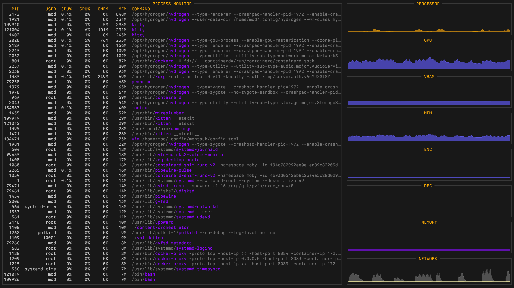
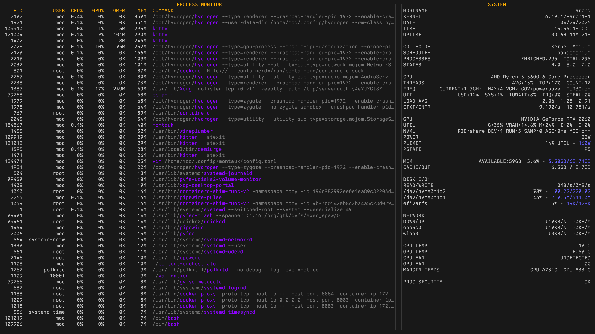
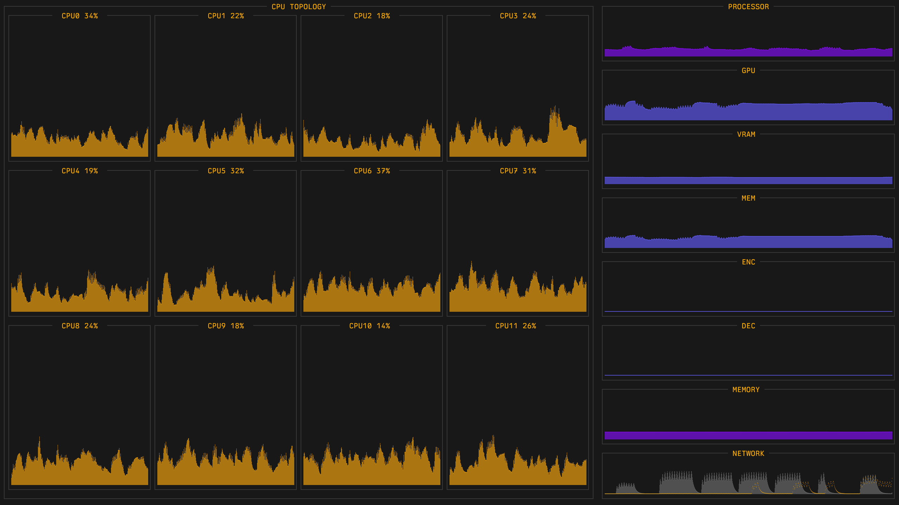

<p align="center">
  
</p>

## montauk

montauk is a Linux observability platform in one statically-linked C++23 binary: An event-driven system monitor, an eBPF flight recorder, an offline analyzer, built on sublimation, its in-tree sort, search, learn core and an MCP stdio JSON-RPC 2.0 server, vector.

The system monitor attributes CPU, multi-vendor GPU, thermal, PMU cost to individual processes in real time and renders area charts over the Kitty graphics protocol. The tracer (`--trace`) is an eBPF flight recorder over a whole process tree, event-driven discovery with no ptrace: Per-thread syscalls and scheduler decisions with wake-to-run latency, sync-object contention, heap traffic, signals, file I/O and hardware counters through `perf_event_open`, at near-zero overhead into a binary log. The analyzer (`montauk_analyze` / `montauk_trace_decode`) folds a 450 MB capture once into 27 single-pass diagnostic reports and cross-run population statistics, no live target and no privileges.

Every surface, the TUI, the Prometheus endpoint and structured JSON, renders from one typed result, provably consistent and enforced by byte-identical golden gates: A script or an agent reads exactly the data the human report shows. That result is enriched, not just measured: The classical-ML core scores each process for anomaly on the live snapshot, and vector, montauk's agent-facing MCP server, serves it over stdio JSON-RPC through seven read-only tools, three that return conclusions rather than metrics.

The kernel module (`montauk-kernel`), the external-metrics provider sockets and `vector` are the only seams to the outside; everything else is one statically-linked C++23 binary.

**sublimation** is montauk's in-tree, adaptive sort, search and learn core: A disorder-classified sort that measures what structure an input already carries (runs, rotation, sampled inversions, a distinct-value estimate, the phase boundary, the Young-tableau shape via patience sorting) and routes every input to the algorithm its structure earns, from a no-op through an O(n) reverse, counting sort, the spectral-merge run tree, a rotation fix and binary insertion, and a distribution radix for random data. Beside the sort is a text-matching engine with three faces (literal, regex, fuzzy k-mismatch), dispatched by pattern shape. Alongside search and sort is the the classical-ML core: Three lanes of pure-algorithm learning (anomaly detectors, a graph-spectral engine, an FFT/signal-residual lane) with zero downloaded weights that turn telemetry into conclusions. The process table's ordering, the analyzer's rankers, the latency-structure classification its reports read and all of montauk's text matching run through it; the `sublimation` CLI exposes the same engine as a shell command with grep-exact exit codes.

**vector** is montauk's stdio JSON-RPC 2.0 server exposing montauk and sublimation to any MCP-speaking agent: A single static Rust binary, zero third-party crates, the same no-dependency stance as the rest of the tree.

## Screenshots

### Main Interface


Default view. PROCESS MONITOR on the left; pixel-rendered area charts (PROCESSOR, GPU, VRAM, GPU MEM, ENC, DEC, MEMORY, NETWORK) stacked on the right. Charts emit through Kitty's `t=t` /dev/shm transport (Sixel fallback) and update at 1 Hz over a 60-second rolling window.

### SYSTEM Focus (`s`)


`s` swaps the right-column chart stack for a text panel: Identity (hostname, kernel, uptime), runtime (collector, scheduler, process states), CPU (model, threads, freq/governor, load avg, ctxt-sw rate), GPU (model, util, NVML, power, p-state), memory, disk I/O, network, thermal margins and process-security findings, severity-colored in place.

### CPU Topology (`Shift+C`)


`Shift+C` swaps PROCESS MONITOR for a dynamic grid of bordered boxes, one per logical CPU, each rendering a pixel-rasterized area chart of that core's recent utilization (60s default, `[chart] history_seconds`) with live util% centered on the top border. Grid columns auto-fit the rect; high-core-count systems fall into scroll mode at minimum cell height. Same monotone-cubic AA rasterizer and Kitty/Sixel emit path as the right-column charts; the right column is unaffected by the toggle.

## Components

| Tool | Invocation | Role |
|---|---|---|
| **monitor** | `montauk` | Event-driven TUI. Per-process CPU and multi-vendor GPU attribution (NVIDIA NVML + `nvidia-smi` fallbacks, AMD sysfs, Intel fdinfo), thermal margins, security findings, live search (literal, regex, fuzzy) and disorder classification. Cell-clipped UI, pixel-rendered area charts (Kitty `t=t` /dev/shm transport, Sixel fallback), three column-swappable views. Optional Prometheus `/metrics` over io_uring, hourly `.prom` logging and a one-shot `--json` snapshot. |
| **tracer** | `montauk --trace PATTERN` | eBPF flight recorder over a whole process tree: Event-driven discovery, no ptrace, no `/proc`. Per-thread state and syscalls, ntsync / futex / keyed-event sync, heap traffic, signals and aborts, file I/O, file-backed mmap, scheduler decisions with wake-to-run latency, CCX-bucketed migrations and hardware PMU counters via `perf_event_open`. Composes with `--metrics`, `--log` and a near-zero-overhead binary log (`--trace-out`). |
| **analyzer** | `montauk_analyze`, `montauk_trace_decode` | Folds a capture once into single-pass diagnostic reports (27 of them, from `waits` and `doublefree` to `dispatch-stall` and `fractal`) over logs reaching 450 MB+, plus recording-directory digests and cross-run population statistics. No live target, no privileges. |
| **sublimation** | `sublimation` CLI + in-tree core  | montauk's sort, search and match core, used everywhere: The process table, every ordering the analyzer emits, the structure classification its reports read and all of montauk's text matching. The CLI exposes the same engine as a complete stream-processing surface: Statistics, structure, text and relational operations, with grep-exact exit codes. |
| **vector** | `components/vector/target/release/vector` | Agent-facing MCP server: Stdio JSON-RPC 2.0, a separate static Rust binary, zero third-party crates. Seven read-only tools, three of them returning conclusions rather than metrics: `montauk_anomalies` (ranked, explained anomalies over the live process population), `montauk_similar` (behavioral nearest by effective resistance) and `montauk_regime` (did the load regime shift, and when), beside `montauk_snapshot`, `montauk_analyze_report`, `montauk_digest` and `sublimation` (direct FFI, no subprocess per call). |

## sublimation: An adaptive sort, search and learn core

**sort core** The sort is a disorder classifier standing in front of six algorithms. One O(n) pass reads how much order an input already carries — run count, monotone runs, descent gaps — and the verdict picks the algorithm that order earns. Sorted input costs a scan. Reversed input costs a reverse. Few-unique goes to a counting sort, rotated data to an O(n) rotation fix, low-displacement data to binary insertion. Past those sit the two poles. Structured data takes a natural-run merge that closes with a spectral merge: Run joins ordered by effective resistance on the run-boundary path Laplacian, so the cheapest joins happen while the data is still hot. Random data takes a distribution radix — a tuned LSD with a combined-histogram scan, a write-combining scatter and a constant-byte skip — because once no order survives, comparison has no edge left to exploit. Equal keys never move, held by a packed-index tiebreak. Type-generic across i32/i64/u32/u64/f32/f64, and at scale both poles fork onto one Chase-Lev work-stealing deque, each at a threshold that was measured rather than assumed.

**search core** The matcher is one engine wearing three faces, and the pattern picks which. The regex face is a Glushkov position-NFA compiled into a bitset field. Thompson's construction — the one this replaced in v8.0.0 — burns its time on epsilon-transitions and a closure computation over a live state set; Glushkov's is epsilon-free, so every state is a position in the pattern, the whole transition function precomputes into one bitmask per input byte, and a match step is a shift and an AND. The pattern fits in a machine word. Nothing backtracks, so a pathological pattern cannot blow up — runtime is linear in the input, always. The price of fitting in a word is a 64-position cap, so an over-long pattern is rejected outright instead of quietly degrading, and a long alternation splits into its branches. Above the field runs a prefilter ladder — a required literal, then a class field, then the alternation branches — each rung anchored on the rarest byte as measured in the data at hand, never a fixed English frequency table. The literal face is that anchor alone. The fuzzy face matches within N substitutions behind a pigeonhole prefilter, something no standard library ships.

**classical-ML core** The learn core is three lanes of classical machine learning with nothing to download: No weights, no training step, no model file. The learn lane ranks every process in the live table — the full population, not a top-N sample — on three detectors chosen to be blind in different directions. MAD modified z-score catches one axis gone extreme. Mahalanobis, through a Cholesky, catches an odd combination of individually ordinary axes. Half-Space Trees catch density with no assumption about shape. They combine by rank rather than raw score, which is the only reason detectors on unrelated scales can be added at all. The spectral lane answers what behaves like this one: Effective resistance through the Laplacian pseudoinverse, a commute-time distance that counts every path between two processes instead of the shortest, so many weak similarities outweigh a single fluke edge. The signal lane is an FFT carrying Spectral Residual — subtract the log-amplitude spectrum's own smoothed average and what remains is the part of the signal that fails to explain itself, which is where a regime shifts. Each lane comes out as a conclusion rather than a number: Anomalies, neighbors, regime shifts.

| Component | Function |
|---|---|
| **disorder classifier** | One O(n) pass → the verdict: `sorted` / `reversed` / `nearly-sorted` / `few-unique` / `phased` / `random`. The analyzer's `sched` report reads it to label a latency timeline's structure. |
| **run-merge tree** | Merges structured runs smallest-boundary-gap-first through a union-find, so the cheapest joins happen while the data is hottest |
| **index sorts** | order a `uint32_t` index array by a numeric key without moving rows (32-bit key packed with its index into one `uint64_t` and sorted adaptively; 64-bit key carried as a satellite, classified and routed to the radix or the spectral merge like the value sort) |
| **string sort** | prefix-pack + MSD-radix, for the process-name column |
| **structural locator** | slides the classifier across a stream to find *where* a disorder pattern sits (`locate`) |
| **randomness battery** | eight entropy lenses (hook-length entropy, LIS vs `2√n`, inversion ratio, distinct ratio, horizontal-visibility degree, ordinal permutation entropy, RQA determinism, spectral flatness on the comparison Laplacian) fused as confidence = (1 − 2⁻ᵏ) × meet, with a typed verdict: Max-entropy / consistent / mixed / structured (`rand`). RQA catches deterministic chaos (the logistic map) that every counting and ordinal lens reads as random. |
| **matcher** | text search, one engine, three faces: Literal/anchor (data-relative rare-byte prefilter), regex (Glushkov bit-parallel field + reach-closure memo + literal prefilter), fuzzy k-mismatch (pigeonhole prefilter). Pattern shape picks the face. Backs `search` and all of montauk's text matching. |
| **value search** | `select` (quickselect) and `searchsorted` (binary, lower/upper bound) |
| **field** | N-th delimited column projection, awk's `{print $N}` |
| **learn lane** | pure-algorithm, zero-weight anomaly detectors over a feature matrix: Robust MAD modified-z (with a mean-absolute-deviation fallback so a constant column does not go blind), EWMA residual, squared Mahalanobis through a  Cholesky and streaming Half-Space Trees. The three spatial detectors (MAD, Mahalanobis, Half-Space Trees) rank-average into the per-process anomaly score montauk enriches its snapshot with, over six features (cpu%, rss, gpu%, page-fault delta, thread count and involuntary context switches — the last being the axis that sees a process getting *preempted*, which none of the other five can) -- each a lens the others cannot see through, MAD per-axis, Mahalanobis for an odd combination, Half-Space Trees for density with no shape assumption; EWMA is the temporal lens, held for the changepoint axis. |
| **spectral lane** | a cyclic-Jacobi symmetric eigensolver, effective resistance (the commute-time graph distance) through the Laplacian pseudoinverse, the Fiedler value with a spectral-gap partition count and Ng-Jordan-Weiss spectral clustering over a  Lloyd k-means. Backs `montauk_similar`. |
| **signal lane** | a  radix-2 FFT and the Spectral Residual saliency detector built on it, a weight-free shape-anomaly detector over a time series. Backs `montauk_regime`. |

**sublimation CLI** enables the full engine to be utilized via the shell for endusers directly. Numeric commands read a value stream (`--field N` pulls a delimited column, folding in awk's extraction): Order and quantiles, k-th selection and value lookup, the reductions (`sum`/`mean`/`min`/`max`/`count`, `stdev`/`variance`), disorder classification, a randomness verdict and `characterize`, the structural verdict that names a stream's disorder class, its randomness and its exploitable structure. `search`, `field` and `where` are the line tools; `group` is datamash / SQL `GROUP BY`, `describe` the one-shot pandas summary, `histogram` the shape, `outliers` the robust Tukey-fence flag; `replace` is `sed s/pat/repl/g` on the same matcher, with `\1`..`\9` backreferences and `\0` for the whole match; `intersect`/`subtract`/`union`/`join` are the two-stream relational lane; `locate --values` is select-by-structure (keep the part of the stream that *is* sorted, random or phased); `uniq`/`cut`/`column`/`tac`/`paste`/`head`/`tail` fill out coreutils and `distinct`/`tally` are `sort | uniq [-c]`.


Nothing requires the pipe to name `sublimation` outright: A few `~/.bashrc` wrapper functions can route the stream forms of `grep`, `sort`, `wc`, `awk`, `cut`, `tac`, `paste`, `sed`, `head`, `tail` and `datamash` to it, so `awk '{print $1,$3}'`, `cut -f2 -d,` or `sed 's/foo/X/g'` resolve to `field`, `cut` or `replace`. The awk language proper (`BEGIN`/`END`, `NF`/`NR`, variables, `printf`, control flow) stays awk's; the wrappers route only the byte-for-byte idioms and rely on sublimation's grep-exact exit codes to keep shell conditionals correct.

| Command | Operation |
|---|---|
| `sublimation sort [--desc] [--keyed]` | order ascending / descending; `--keyed` keeps the whole line, ordering by the key (`--field N` or the whole line), coreutils' `sort -k` with stable ties |
| `sublimation quantile Q [--nearest]` | the Q-quantile (Q in 0..1); `--nearest` for the nearest-rank order statistic |
| `sublimation select K` | the K-th smallest (0-based) |
| `sublimation searchsorted V` | insertion index of V in the sorted input |
| `sublimation sum \| mean \| min \| max` | reductions over the value stream, awk's `{s+=$N}` family |
| `sublimation stdev \| variance` | sample (n−1) standard deviation / variance |
| `sublimation count [--words\|--bytes]` | line / word / byte count, `wc -l/-w/-c` |
| `sublimation head N` / `tail N` | first / last N lines |
| `sublimation describe \| histogram \| outliers` | pandas-style summary, 10-bin text histogram, Tukey-fence outliers |
| `sublimation classify` | disorder class + profile of the stream |
| `sublimation locate CLASS [--values]` | the windows where a disorder pattern sits; `--values` emits the data in them |
| `sublimation rand` | randomness confidence from the eight-lens battery |
| `sublimation characterize` | the structural verdict: Disorder class, randomness confidence, sort efficiency |
| `sublimation search PATTERN [FILE..]` | matching lines from stdin or files; regex by default, `-F` fixed string, `-k N` fuzzy k-mismatch |
| `sublimation replace PAT REPL` | global per-line regex substitution, `sed s/pat/repl/g` |
| `sublimation field N,M [--delim D]` | the N-th column, or a comma-list, awk's `{print $N}` and `{print $1,$3}` |
| `sublimation where 'N OP V'` | lines whose field N satisfies the numeric predicate, awk's `$N OP V` |
| `sublimation group KEY OP [VAL]` | group by field KEY, aggregate field VAL — `sum`/`mean`/`count`/`min`/`max`/`sstdev`/`pstdev`/`first`/`last`/`median`/`mode`/`antimode`/`unique`/`collapse`/`countunique`, byte-verified against datamash `-g` |
| `sublimation search --dispersion PAT` | the *shape* of where a pattern falls: density, stride spread, burstiness, gap disorder class, spectral saliency, matrix-profile discord |
| `sublimation uniq \| cut \| column \| tac \| paste -s` | the coreutils line idioms |
| `sublimation distinct \| tally` | distinct-token count / per-token frequency, `sort \| uniq [-c]` |
| `sublimation intersect \| subtract \| union \| join` | the two-stream relational lane |

`search` carries the full grep working set: `-F`/`-E`/`-k N` pick the face, `-i` and `-S` (smart case) handle casing, `-v`/`-c`/`-n`/`-o`/`-q`/`-m N` shape output, `-A`/`-B`/`-C` add context, `-w`/`-x` anchor to words or whole lines, `-e PAT`/`-f FILE` build multi-pattern sets, `-l`/`-L` name files with or without a match, `-H`/`-h`/`--label` control the filename prefix, `-s` silences unreadable-file messages, `-a`/`-I` set binary-file handling, `--color=auto|always|never` highlights, `--line-buffered` flushes per line and `--files-from LIST` reads input paths from a list (`find ... -print0 | sublimation search PAT --files-from -`). That last flag is the traversal affordance: Native directory walking deliberately stays with grep and rg, by the division-by-target rule below. Exit codes are grep's contract exactly: 0 matched, 1 nothing, 2 unreadable input. The whole surface is byte-verified against GNU grep and coreutils in a 114-case parity gate plus an exit-code oracle.

**`search --dispersion` is montauk's first text sensor.** Every other sensor reads structured telemetry — CPU, GPU, thermal, PMU, sched — so "where does this pattern cluster in this log, and does its burst line up with something else that moved" had no answer, which left grep the last metric-not-conclusion tool in the box. The instruments run over the **sparse match positions**, never the haystack: the matcher skips billions of bytes, the instruments relate a few thousand arrivals. That is the separation law resolved rather than bent — the relate-shaped primitives that keep being proposed *inside* the matcher belong above it, on its output. Burstiness is the Goh-Barabási coefficient, scale-free by construction so a dense pattern and a rare one compare directly: validated at −0.913 for strictly periodic arrivals, −0.022 for a memoryless 5%-per-line pattern and +0.877 for one confined to three windows, with the disorder classifier agreeing independently.

**`-i` folds beyond ASCII, and stops where the encoding stops cooperating.** The matcher is a byte-positional Glushkov field, so a case fold is only admissible when the two forms keep the same UTF-8 *byte length* and differ only in the *last* byte — otherwise the automaton would either blow its fixed position budget or start accepting mixed sequences (upper's lead byte with lower's tail), which decode to a third character nobody wrote. 1791 pairs qualify: Latin-1 Supplement 98%, Latin Extended-A 96%, Greek 56%, Cyrillic 33%. The unevenness is structural — a block folds cleanly until it crosses a UTF-8 second-byte boundary, which is why Cyrillic `москва` matches `Москва` but not `МОСКВА` (`с`/`С` straddles U+0440 and changes its lead byte). Characters that cannot fold match **exactly**, so `-i` narrows rather than widens, and sublimation prints a one-line notice saying so instead of letting the difference pass unremarked. The fold table is generated from Unicode data, not hand-written: an earlier hand-rolled version of it was wrong in 20 of 242 cases in a single block.

For example: `cat dump | sublimation quantile 0.99 --field 2` for a column's 99th percentile, `ps aux | sublimation where '6 > 100000'` to keep the heavy processes, `seq 1 1000 | shuf | sublimation characterize` to name a stream's shape. The division is by **target**: sublimation owns the stream (the column, filter, reduce, order and structure idioms) while `grep`, `find` and `awk` keep filesystem traversal and the awk language itself.

**Performance**

AMD Ryzen 5 3600, Zen 2, `-O2 -march=native`, ns/element, best of 5; the harness is in-tree at `sublimation/tests/bench/`, each language sorting the same seeded data with its own standard library: C `qsort`, an inline introsort, Rust `slice::sort_unstable` (ipnsort), Go `slices.Sort` and Python `sorted`. Keys are full-width — a narrower fill leaves the top bytes of a 64-bit key constant, which gives a radix a free pass skip that a comparison sort never gets.

**Structured Sort Performance** (n = 100K)

Where the adaptive routing pays: The sort reads the order an input already carries instead of rebuilding it, so a comparison sort's O(n log n) is work it never does.

| Pattern | sublimation | Rust | Go | introsort | qsort | Python |
|---|--:|--:|--:|--:|--:|--:|
| sorted | **0.1** | 0.2 | 0.5 | 4.6 | 21.8 | 3.3 |
| equal | **0.1** | 0.3 | 0.5 | 8.5 | 22.8 | 2.6 |
| reversed | 0.5 | **0.4** | 0.8 | 5.2 | 31.0 | 5.2 |
| pipe-organ | **2.9** | 17.5 | 23.1 | 51.0 | 26.6 | 7.9 |
| nearly-sorted | 10.3 | 15.9 | 13.8 | **8.0** | 39.9 | 17.1 |
| few-unique | 13.7 | **2.2** | 8.3 | 17.6 | 53.7 | 57.2 |
| phased | 35.3 | **13.2** | 30.0 | 51.2 | 102.0 | 37.3 |
| random | 33.0 | **16.0** | 66.0 | 48.9 | 96.3 | 127.6 |

Sorted and equal input costs a scan, and pipe-organ — one ascending run and one descending — is read as two runs and merged rather than partitioned, which is where the run-merge tree earns its keep. The honest losses are also here: Rust's pdqsort has a dedicated equal-elements partition that beats the counting sort on few-unique, and introsort wins nearly-sorted at this size.

**Random Sort Performance**

Where there is no structure to exploit, so the radix competes head-on with tuned in-place comparison sorts.

| n | sublimation | Rust pdqsort | Go | introsort | qsort | Python |
|---|--:|--:|--:|--:|--:|--:|
| 100K | 33.0 | **16.0** | 66.0 | 48.9 | 96.3 | 127.6 |
| 1M | **15.6** | 18.1 | 77.8 | 61.6 | 122.8 | 215.5 |
| 10M | **15.6** | 20.6 | 89.5 | 68.9 | 139.7 | 348.8 |
| 100M | **16.0** | 23.2 | 101.6 | 78.9 | 162.0 | 510.1 |

Below the parallel threshold the radix is a serial LSD and Rust's pdqsort wins outright at 100K. From 1M up both poles fork onto the work-stealing deque and sublimation takes the lead, holding flat at 15.6-16.0 ns/element from 1M through 100M while every comparison sort degrades as the working set leaves cache — the crossover the thresholds exist to find. The margin widens with n: 1.2x over Rust at 1M, 1.5x at 100M; against C's `qsort` 8-10x, against Go 5-6x, against Python 14-32x.

**Search Performance**

AMD Ryzen 5 3600, Zen 2, MB/s on 4 MB corpora, higher is better. The harness is in-tree at `sublimation/tests/search/bench/`: Seeded deterministic corpora, median-of-9, with C, C++, Go, Rust-std and Rust-regex comparators, byte-parity-gated against Python `re`, a brute k-mismatch oracle and a position checksum. The regex face against the Rust `regex` crate (ripgrep's engine, SIMD Teddy + lazy DFA) and Go `regexp` (RE2 lineage):

| Pattern | corpus | sublimation | Rust regex crate | Go regexp |
|---|---|--:|--:|--:|
| `A[CG]TT` | DNA | **273** | 234 | 39 |
| `str[a-z]ct` | source | 1.6k | 4.7k | 484 |
| `MARK[A-Z]R` | repetitive | 26.7k | 56.9k | 52.7k |

A scalar bit-parallel field, measured against a SIMD one. It wins where the pattern is dense and literal-poor and the reach-closure memo does the work (`A[CG]TT`, ahead of every engine measured and 7x Go). It loses where a literal prefilter is the whole game and Rust's is vectorized: `str[a-z]ct` by 2.9x and `MARK[A-Z]R` by 2.1x. That is the one standing gap and it is a stated non-goal — Teddy/FDR-class multi-literal SIMD is deliberately not built, because chasing grep's throughput is not what sublimation is for. Against Python `re`, C++ `std::regex` and POSIX the margin is 3-500x on every pattern. **Fuzzy k-mismatch is a face no standard library ships at all**: `SIGKILL` k=1 at 8.8k MB/s, with no competitor to put in the column.

**Build.** Compiled as a static library with montauk. Requires a Haswell-or-newer CPU (BMI2 + AVX2) and gcc 13+ (C23).

**Where montauk uses it:** The process-table sort and the analyzer's orderings (latency quantiles, report rows, struct-by-key sorts via `sublimation_order_*`, value lookups via `searchsorted`); the `sched` report's structure classification and locator; and all of montauk's text matching (kernel-thread classification, the live `/`-search, `--trace` token matching). montauk's C++ carries zero `std::sort`, `std::stable_sort` or `std::nth_element` call sites; every ordering routes through sublimation.

## vector: An agent-facing tool surface

montauk's Rust MCP server — where an agent interrogates the platform directly. Registration is one line, and nothing in it can go stale: No venv, no interpreter to resolve, no PATH entry pointing at a script that moved.

```
claude mcp add --scope project montauk -- components/vector/target/release/vector
```

Seven tools, read-only and observational only (no killing processes, no scheduler-policy changes, nothing mutating, stated explicitly in every tool description). Three return conclusions rather than metrics: What is anomalous, what behaves like a given process and what shifted.

| Tool | Wraps | Function |
|---|---|---|
| `montauk_anomalies` | `montauk --json` features + learn lane (FFI) | fuses MAD + Mahalanobis + Half-Space Trees in-process over the full live process population and returns the top processes by anomaly score with the dominant feature axis and a plain-language note |
| `montauk_similar` | `montauk --json` + spectral lane | the processes behaving like a given one: A standardized feature vector per process, a self-tuning (local-scaling) affinity graph so an outlier query keeps a defined neighborhood, ranked by effective resistance (commute-time distance) FFI'd out of the spectral lane |
| `montauk_regime` | `/proc/stat` + signal lane | did the machine's load regime shift recently, and when: Samples aggregate CPU over a short window and runs Spectral Residual to locate shifts, each with how many seconds ago |
| `montauk_snapshot` | `montauk --json` | one-shot structured snapshot of live system state |
| `montauk_analyze_report` | `montauk_analyze FILE --report ... --json` | diagnostic reports over a trace file as the structured JSON envelope |
| `montauk_digest` | `montauk_analyze DIR --digest --json` | compact specs + stability + thermal + offenders digest over a recording directory |
| `sublimation` | direct FFI into `libsublimation.a` | sort / classify / search, no subprocess spawn per call |

The three conclusion tools compute their math **in-process** through `extern "C"` bindings into the learn, spectral and signal lanes of the same static library `montauk_core` and `montauk_analyze` already link -- the anomaly fusion (`sublimation_anomaly_fuse`, the *same* primitive montauk's own snapshot enrichment calls, so the numbers agree by construction), effective resistance and the Spectral Residual all run over FFI, never a spawned process for the computation. `montauk_anomalies` and `montauk_similar` read the live snapshot from `montauk --json` first (features in, conclusion computed here); `montauk_regime` reads `/proc/stat` directly, needing no snapshot; `montauk_snapshot`, `montauk_analyze_report` and `montauk_digest` wrap the standalone `montauk` and `montauk_analyze` processes.

Four substantive source files plus glue: `rpc.rs` (a hand-rolled JSON-RPC 2.0 loop over stdio; stdout carries protocol messages only, all logging goes to stderr), `json.rs` (a  JSON parser and serializer; `include/util/json.h` is write-only by design, so this is the first thing in montauk that reads JSON), `ffi.rs` (the bindings, linked via `build.rs` against `libsublimation.a`) and `tools.rs` (the tool registry, dispatch and JSON Schemas). `main.rs`/`lib.rs` are the wrapper and module glue.

## montauk's CLI Operating Modes

montauk composes its modes from CLI flags:

| Command | Operation |
|---|---|
| `montauk` | TUI only |
| `montauk --log /var/log/montauk` | TUI + Prometheus-format log files |
| `montauk --log /var/log/montauk --log-interval-ms 5000` | Custom write interval (default: 1000ms) |
| `montauk --metrics 9101` | TUI + Prometheus endpoint on :9101 |
| `montauk --headless --metrics 9101` | Daemon mode: Prometheus only, no TUI |
| `montauk --headless --metrics 9101 --log /var/log/montauk` | Daemon mode: both |
| `montauk --headless --log /var/log/montauk` | Daemon mode: logging only |
| `montauk --headless` | Error: requires --metrics or --log |
| `montauk --trace firefox` | Trace mode: per-thread diagnostics for process group |
| `montauk --trace APP --metrics 9101` | Trace mode + Prometheus endpoint |
| `montauk --trace APP --log /tmp/trace` | Trace mode + flight recorder |
| `montauk --trace APP --trace-out FILE.bin` | Trace mode + raw binary event log |
| `montauk --trace APP --trace-ring-bytes 64M` | Size the BPF ring (K/M/G; default 1M) |
| `montauk --trace APP --trace-classes sched,exec` | Capture only the named event classes |
| `montauk --trace APP --stream-out /dev/ttyS1` | Second binary stream to a character device |
| `montauk --json` | One-shot structured system snapshot (JSON), then exit. |
| `montauk --anomalies 5` | Rank what is anomalous right now, with the dominant axis |
| `montauk --similar PID` | Processes behaving like PID (`--similar-top N` for how many) |
| `montauk --regime 64` | Did the load regime shift recently, and when |
| `montauk --cpu-window 64` | Sample aggregate CPU N times, emit the series |
| `montauk --pmu-comm SUBSTR` | Attach per-process hardware counters (no root, no sysctl) |
| `montauk_trace_decode FILE.bin` | Decode a binary log to text (--csv for CSV) |
| `montauk_analyze FILE.bin --json`  | Emit the diagnostic reports as one JSON envelope. |
| `montauk_analyze FILE.bin --report waits` | Run an analysis report over a binary log |
| `montauk_analyze FILE.bin --golden g.golden` | Compare each report's class against a frozen golden |
| `montauk_analyze RECORDING_DIR --golden g.golden` | Same two lanes over a whole recording (reaches the PMU counters) |
| `montauk_analyze FILE.bin --golden g.golden --update --label NAME` | Freeze the classes (and `--watch`ed gauges) |
| `montauk_analyze RECORDING_DIR --digest` | One-call shareable digest over a whole recording |
| `montauk_analyze RECORDING_DIR --l2-by-cpu` | Localize L2 misses per CPU over the busy window |
| `montauk_analyze DIR --by LABEL` | Population statistics across many runs |
| `montauk --init-theme` | Detect terminal palette, write config.toml |
| `montauk --iterations N` | Render N frames then exit (scripting and self-test) |

**Live output.** `--metrics PORT` serves Prometheus exposition (0.0.4) at `/metrics` over io_uring — ~55 `montauk_` families across CPU, memory, network, disk, filesystems, process states, per-process top-N and per-device GPU. `--log DIR` writes the same text to disk, rotating hourly as `montauk_YYYY-MM-DD_HH.prom`. Both read the TUI's own lock-free buffers and compose with each other and with `--trace`.

**Structured JSON.** `montauk --json` prints one live snapshot and exits (two producer cycles warmed first, so rate deltas are real); with `--trace` a second JSON-lines record carries the trace snapshot. `montauk_analyze FILE --json` emits the reports as one envelope. JSON is a renderer over the same typed result as text and Prometheus, gated byte-identically — montauk writes JSON, never parses it.

**Conclusions, not payloads.** Four modes answer a question directly instead of returning the state to derive it from — `--anomalies N` ranks the fused anomaly score montauk already computes, naming each process's dominant axis; `--similar PID` returns effective-resistance nearest neighbours over a self-tuning affinity graph of the live population; `--regime N` runs a spectral residual over a sampled CPU window and reports whether load shifted and when; and `montauk_analyze DIR --digest` does the same for a recording. They exist because the answer is small and the state is not: `--anomalies` costs about 600 bytes where the snapshot it derives from costs 67,000. `--similar` collapses identical feature vectors before solving, since a process table is mostly idle duplicates and an uncollapsed graph returns the same resistance for every one of them; the reply carries `identical_peers` and the true `graph_nodes` count. `--cpu-window N` exposes the raw sampled series when the window itself is wanted rather than a verdict.

**Trace mode.** `--trace PATTERN` runs headless, attaching BPF to scheduler, syscall, signal and fd/mmap tracepoints plus libc uprobes; no `/proc` scanning after attach. Matching is in-kernel at exec, first syscall, `prctl(PR_SET_NAME)` and fork, so thread pools, container runtimes and self-renaming daemons are caught and children auto-track. Captures per-thread state, syscalls with decoded arguments, on-CPU time, fds, file I/O, futexes, heap traffic, signals with stack snapshots, mmap, scheduler decisions, per-CCX migrations and ntsync. `--sched-detail` adds the per-switch stream the placement, slice and stall reports need (~6x cost). Requires root.

**Capture sizing.** `--trace-ring-bytes N` (K/M/G) sizes the BPF ring: on one workload the 1M default dropped 46,214 events where 64M dropped zero. `--trace-classes LIST` mutes classes so a loud one cannot drown the one being captured; an excluded class is not counted as a drop. `--trace-out FILE` writes raw records in ~256 KB batches with monotonic/realtime anchors; `--stream-out DEVICE` mirrors to a character device so a capture survives a filesystem hang.

**Offline analysis.** `montauk_trace_decode FILE.bin` renders a text event stream (`--csv` for CSV). `montauk_analyze` runs single-pass reports, each folding the file once, narrowed by `--sig`, `--comm`, `--pid`, `--tid` or `--window`: `summary`; sync (`waits`, `spins`, `pairing`, `endstate`, `futex`, `keyedevt`); heap (`heapstk`, `doublefree`, `abortpm`); `signals`; I/O (`iolat`, `iowait`); scheduler (`sched`, `slice`, `service`, `wakers`, `work-conservation`, `placement-race`, `dispatch-stall`, `kick-latency`, `storm`, `kstrand`, `locality`, `classmix`, `field-persist`, `fractal`). Over a recording directory: `--digest [--redact]`, `--l2-by-cpu`, `--by LABEL`.

**Behavioral goldens.** `--golden FILE` has two lanes. `--functional` (default) freezes each report's categorical class and compares it exactly — a class flip is a different defect, not a degree. `--performance` is opt-in, freezing gauges picked with `--watch` within `max(tolerance%, floor)`. Exit is 0 pass, 1 a frozen fact moved, 2 DECLINED, the third distinct because "this regressed" and "this was never checked" differ. It declines below 95% completeness, on UNKNOWN completeness (`--allow-unknown` overrides), on an uninterpretable line, and on a frozen report the run did not produce. Over a recording directory it also reaches the `montauk_pmu_*` counters in the sibling scrapes, recording a reduction per line (`last`, `mean`, `point`, `--reduce`).

**Hardware counters.** Trace mode samples per-CPU L2, instructions, cycles, context switches, migrations, branch misses and per-CCX L3 where available, as `montauk_pmu_*` rates plus cumulative `_total`s, alongside RAPL power/energy, frequency, idle residency and energy-per-instruction. Needs `perf_event_paranoid <= 0` or `CAP_PERFMON`. **`--pmu-comm SUBSTR` / `--pmu-pid N` are the unprivileged half**, not gated behind trace mode: they open at the ordinary paranoid of 2 and attach instructions, cycles, dTLB load misses and cache misses per matching process, re-resolved each tick. Whether kernel time is excluded is published (`montauk_pmu_per_process_user_only`).

**External providers.** `ProviderCollector` reads one Prometheus-text snapshot from each `<name>.sock` under `$XDG_RUNTIME_DIR/montauk/providers/` (fallback `/run/montauk/providers/`). Providers self-identify by filename; a missing directory is a silent no-op. Text passes through verbatim and embeds into the binary trace stream. Export-only.

## Installation

### Simple Install

```bash
./install.py
```

### Advanced Install (CMake)

```bash
cmake -B build -DCMAKE_BUILD_TYPE=Release
cmake --build build -j$(nproc)
sudo cmake --install build   # optional
```

liburing is auto-detected at configure time and enables the Prometheus metrics endpoint; without it montauk builds normally with the endpoint disabled.

### Other Commands

```bash
./install.py build      # Build only, don't install
./install.py clean      # Clean build directory
./install.py uninstall  # Remove installed binary
./install.py test       # Run tests
./install.py --kernel   # Build with kernel module support
./install.py --debug    # Debug build
```

### Arch Linux Package

```bash
makepkg -si   # From the PKGBUILD at the repo root
```

## Uninstall (CMake)

```bash
sudo xargs rm -v < build/install_manifest.txt
```

## Packaging (Arch Linux)

- PKGBUILD at the repo root; `makepkg -si` installs to `/usr/bin/montauk`
- Build deps: `cmake`, `gcc`, `make`
- Optional build: `liburing` (Prometheus endpoint); optional runtime: `nvidia-utils`
- NVML auto-detected at build time; tests off by default

### TUI Process Collection

montauk auto-detects the best available backend, in this priority:

| backend | mechanism | requires | CPU overhead | event detection | syscalls per snapshot |
|---|---|---|---|---|---|
| **kernel module** | genetlink read of the in-kernel table; kprobes update it directly, workqueue refreshes CPU times at 1 Hz; zero `/proc` reads, zero netlink event traffic | `montauk.ko` loaded | ~0.1-0.2% | sub-millisecond | 1 |
| **netlink proc_connector** | fork/exec/exit events from the kernel, `/proc/[pid]/*` reads for details | `CAP_NET_ADMIN` | ~0.5-1% | sub-millisecond | ~1 + N events |
| **/proc polling** | scans `/proc` each cycle; identical functionality and UI | nothing | ~2-5% | ~1s | ~3 per process |

To enable netlink proc_connector when the kernel module isn't loaded:
```bash
sudo setcap cap_net_admin=ep /usr/local/bin/montauk
```

Force a backend for testing:
```bash
MONTAUK_COLLECTOR=kernel ./montauk       # requires montauk.ko
MONTAUK_COLLECTOR=netlink ./montauk      # requires the capability
MONTAUK_COLLECTOR=traditional ./montauk  # /proc polling
```

## TUI Controls

**Navigation:** `q` quits; `↑/↓` scrolls the process list; `PgUp/PgDn` pages.

**Search/Filter:** `/` or `Ctrl+F` enters live case-insensitive substring filtering; `Enter` confirms, `Esc` exits (or clears an active filter from normal mode); `Backspace` deletes (empty backspace exits).

**Sorting:** `c` CPU%, `m` Memory, `g` GPU%, `v` GPU Memory, `p` PID, `n` Name.

**Modes and toggles:**
- `s` toggles SYSTEM focus (right column: Chart stack ↔ text panel)
- `C` (Shift+C) toggles the CPU TOPOLOGY grid (left column; arrows and PageUp/PageDown scroll on high-core systems; `Esc` or `C` returns). The two column toggles are independent.
- `i` toggles CPU scale: Machine-share (100% = the whole machine, processes sum toward system usage) ↔ per-core IRIX-style (100% = one core, multi-threaded apps exceed 100%)
- `u` toggles GPU scale (capacity ↔ utilization)
- `G` toggles the GPU charts (util / VRAM / GPU MEM / ENC / DEC)
- `t` toggles the Thermal section inside SYSTEM focus
- `R` resets the UI; `+/-` adjusts the refresh rate

**Help overlay:** `?` or `h` opens it. The overlay loads `man montauk` at runtime and renders it inside the PROCESS MONITOR column, reflowing to the available width via `MANWIDTH`; edit `montauk.1` and the overlay updates on next open. While open: `j`/`k` scroll, `d`/`Space` page down, `u` page up, `g`/`G` jump, `q`/`?`/`Esc` close.

## Configuration

montauk reads a unified TOML file at `~/.config/montauk/config.toml`, resolving each value TOML → `MONTAUK_*` environment variable → compiled default; no file means compiled defaults at zero overhead. `montauk --init-theme` writes a starter with your terminal's 16-color palette detected. The full schema (`[palette]`, `[roles]`, `[thresholds]`, `[ui]`, `[process]`, `[nvidia]`, `[keybinds]`), the process-collector settings and the complete `MONTAUK_*` reference live in [`CONFIG.md`](CONFIG.md). The process columns, two-column layout and severity color coding are documented in [`CONFIG.md`](CONFIG.md#display-details).

## GPU Support

### NVIDIA

Full NVML integration (recommended): Per-process GPU utilization (SM, encoder, decoder), per-process VRAM, device-level metrics (util, power, temps, clocks), MIG detection and PRIME render offload. Runtime needs `nvidia-utils` (`libnvidia-ml.so.1`); montauk loads NVML dynamically, no dev headers required. Static NVML linkage is an optional CMake opt-in via the `cuda` headers.

When NVML is unavailable or insufficient, montauk walks a fallback chain: Device-level `nvidia-smi --query-gpu=…`, `nvidia-smi pmon` per-process sampling, `nvidia-smi --query-compute-apps` for compute memory, `/proc/driver/nvidia/gpus/*/fb_memory_usage` for device VRAM, then heuristic distribution from device-level metrics.

### AMD/Intel

`/sys/class/drm` for VRAM, temperatures and power; `/proc/*/fdinfo` (DRM) for per-process utilization; `gpu_busy_percent` for device utilization.

### Browser GPU Process Detection

montauk identifies browser GPU processes (Chrome, Chromium, Helium, etc.) by scanning for `--type=gpu-process` in command lines, enriching up to 256 processes with full cmdline data, applying fallback attribution when processes use minimal CPU and inspecting `/proc/*/fd` device files for decode-only workloads.

### GPU Configuration

All GPU settings live under `[nvidia]` in TOML. Env var fallbacks:

```bash
MONTAUK_NVIDIA_PMON=0     # [nvidia] pmon = false
MONTAUK_NVIDIA_MEM=0      # [nvidia] mem = false
MONTAUK_LOG_NVML=1        # [nvidia] log_nvml = true
MONTAUK_NVIDIA_SMI_DEV=0  # [nvidia] smi_dev = false
MONTAUK_NVIDIA_SMI_PATH=… # [nvidia] smi_path = "…"
MONTAUK_SMI_MIN_INTERVAL_MS=1000  # [nvidia] smi_min_interval_ms = 1000
MONTAUK_GPU_DEBUG=1       # [nvidia] gpu_debug = true
MONTAUK_DISABLE_NVML=1    # [nvidia] disable_nvml = true
MONTAUK_NVML_PATH=…       # [nvidia] nvml_path = "…"
```

## Churn Handling

During heavy system activity (builds, installs, rapid process creation), `/proc` and `/sys` entries vanish between directory scans and file reads. This affects the userspace collectors; the kernel module is immune, since it reads `task_struct` directly. montauk absorbs churn without breaking: Churned processes may show partial metrics for one sample, then clear, and the system stays responsive throughout.

When churn is active, the SYSTEM box swaps PROC SECURITY for a PROC CHURN readout: A summary line (`PROC CHURN  N events [LAST 2s]`, colored as caution), a `PROC:X  SYSFS:Y` source breakdown and the affected PIDs (the event count can exceed the visible PIDs, since processes exit before the display updates). When churn subsides, PROC SECURITY returns automatically. Reproduce it with the stress script under [Testing](#testing).

## Testing

**Build with tests:**
```bash
cmake -S . -B build -DMONTAUK_BUILD_TESTS=ON
cmake --build build -j
./build/montauk_tests
```

With liburing, this includes the Prometheus serializer tests. A standalone `montauk_json_test` checks the in-tree JSON writer byte-for-byte and validates its output through `python -m json.tool`.

**One runner (`tests/run.py`)** drives four layers: The C++/C23 unit tests, the Python gate layer, the live BPF trace harness (root; skipped, not failed, without it) and vector's own `cargo test`. The gate layer stacks five proofs:

- `corpus_check.py` freezes the analyzer's reports, the decoder's output, the `sublimation` CLI and the analyzer's `--json` envelope against goldens over a deterministic synthetic capture; any surface changing a byte fails the gate, and a per-report parity pass asserts every report emits identical gauges in its text (`.prom`) and JSON renderings.
- `parity_check.py` runs 74 cases of sublimation verbs against the real coreutils and GNU grep on identical input (one skips where datamash is absent) and fails on any byte divergence: The regression guard that keeps shell-wrapper routing safe.
- `pop_gate.py` pins the population mode: An injected +50% shift must be found (full-magnitude Cliff's delta at the boundary pair) and a stable family must yield no change point.
- `semantic_check.py` rejects any emitted gauge family whose help text is a placeholder or an echo of its own name.
- `golden_gate.py` pins the behavioral-golden checker's own contract: the freeze/check round trip, the three exit codes kept distinct, and every path that DECLINES rather than answering. The golden's bytes cannot be frozen (they carry the freezing host's kernel and CPU), so what is gated is the behavior, and most of the weight sits on the refusals: a gate that answers PASS when it could not actually compare is the failure this whole surface exists to prevent.

sublimation carries its own standalone suite under `sublimation/tests/` (843k checks green, ASan and TSan clean, with libc sorts surviving only as differential oracles) plus the search byte-parity oracle (Python `re`, brute k-mismatch, position checksum) and the in-tree sort and search benches.

**Self-test mode:** `./build/montauk --self-test-seconds 5`

**Churn stress:** `tests/proc_churn.sh 30 100` spawns and destroys 100 processes/second for 30 seconds to exercise `/proc` resilience on the userspace collectors. Watch it with montauk running (`s` for SYSTEM focus).

Tests are disabled by default in packaging builds (`MONTAUK_BUILD_TESTS=OFF`).

## Policy

Vendoring is enforced, not aspirational: CMake poisons `FetchContent_Declare` and `ExternalProject_Add` with `FATAL_ERROR` at configure time, so a third-party fetch cannot enter the build. NVML and liburing are auto-detected and gracefully disabled when unavailable.

## References

The work the algorithms descend from. Source-comment attributions and the [Lineage](#sublimation-an-adaptive-sort-search-and-learn-core) paragraph resolve here; sibling-project lineage (the OUROBOROS-derived UI, PANDEMONIUM's oscillator envelope) is in-house.

**Lineage.** Influenced by flow-model research (Kyng-Dinic maximum flow, spectral graph theory); the lineage survives in the spectral merge (effective resistance on the run-boundary path Laplacian), the graph-spectral learn lane (effective resistance as commute-time distance, Ng-Jordan-Weiss clustering) and the adaptive-control primitives. The rest of the family tree: Robinson-Schensted correspondence (sorting ↔ Young tableaux), TimSort (the run-adaptive lineage; the prior C++ TimSort/Powersort implementation is archived out of tree), Thompson's NFA construction (the prior regex engine, retired in v8.0.0 for the Glushkov field), Fiedler spectral seriation (Atkins-Boman-Hendrickson), the classical-ML detectors (Iglewicz-Hoaglin robust z, Tan-Ting-Liu Half-Space Trees, Ren et al. Spectral Residual), CoDel and damped-oscillator adaptive control, AlphaDev-shaped AVX2 sorting networks, and the radix arm (Wassenberg-Sanders write-combining, Skarupke's ska_sort and American Flag MSD, the eloj/radix-sorting notes).

**Sorting and structure**
- G. de B. Robinson, "On the Representations of the Symmetric Group", American Journal of Mathematics 60, 1938. C. Schensted, "Longest increasing and decreasing subsequences", Canadian Journal of Mathematics 13, 1961.
- J. S. Frame, G. de B. Robinson and R. M. Thrall, "The hook graphs of the symmetric group", Canadian Journal of Mathematics 6, 1954.
- D. Aldous and P. Diaconis, "Longest increasing subsequences: from patience sorting to the Baik-Deift-Johansson theorem", Bulletin of the AMS 36, 1999.
- J. Baik, P. Deift and K. Johansson, "On the distribution of the length of the longest increasing subsequence of random permutations", Journal of the AMS 12, 1999.
- T. Peters, "Timsort", CPython `Objects/listsort.txt`, 2002. J. Ian Munro and S. Wild, "Nearly-Optimal Mergesorts" (Powersort), ESA 2018 — the run-adaptive merge lineage.
- O. R. L. Peters, "Pattern-defeating Quicksort", arXiv:2106.05123, 2021.
- D. J. Mankowitz et al., "Faster sorting algorithms discovered using deep reinforcement learning", Nature 618, 2023 — the AVX2 small-sort networks.
- J. Wassenberg and P. Sanders, "Engineering a Multi-Core Radix Sort", Euro-Par 2011 (write-combining buffered scatter); M. Skarupke, "I Wrote a Faster Sorting Algorithm" (ska_sort) and American Flag sort, 2016-2017; the eloj/radix-sorting notes — the radix arm.
- N. M. Lê, A. Pop, A. Cohen and F. Zappa Nardelli, "Correct and Efficient Work-Stealing for Weak Memory Models", PPoPP 2013 — the Chase-Lev deque the parallel engine is built on.
- L. Bergdoll and O. Peters, ipnsort, the Rust standard library's `sort_unstable` implementation as of Rust 1.81, 2024 — a perf comparator.

**Text matching**
- K. Thompson, "Programming Techniques: Regular expression search algorithm", Communications of the ACM 11(6), 1968.
- V. M. Glushkov, "The abstract theory of automata", Russian Mathematical Surveys 16, 1961.
- R. S. Boyer and J S. Moore, "A fast string searching algorithm", Communications of the ACM 20(10), 1977. R. N. Horspool, "Practical fast searching in strings", Software: Practice and Experience 10(6), 1980.

**Spectral and flow heritage**
- M. Fiedler, "Algebraic connectivity of graphs", Czechoslovak Mathematical Journal 23, 1973.
- A. Y. Ng, M. I. Jordan and Y. Weiss, "On Spectral Clustering: Analysis and an algorithm", NIPS 14, 2001.
- D. J. Klein and M. Randić, "Resistance distance", Journal of Mathematical Chemistry 12, 1993.
- J. E. Atkins, E. G. Boman and B. Hendrickson, "A spectral algorithm for seriation and the consecutive ones problem", SIAM Journal on Computing 28(1), 1998.
- E. A. Dinic, "Algorithm for solution of a problem of maximum flow in a network with power estimation", Soviet Mathematics Doklady 11, 1970.
- L. Chen, R. Kyng, Y. P. Liu, R. Peng, M. Probst Gutenberg and S. Sachdeva, "Maximum Flow and Minimum-Cost Flow in Almost-Linear Time", FOCS 2022.

**Randomness battery**
- C. Bandt and B. Pompe, "Permutation entropy: a natural complexity measure for time series", Physical Review Letters 88, 174102, 2002.
- B. Luque, L. Lacasa, F. Ballesteros and J. Luque, "Horizontal visibility graphs: Exact results for random time series", Physical Review E 80, 046103, 2009.
- J. P. Zbilut and C. L. Webber Jr., "Embeddings and delays as derived from quantification of recurrence plots", Physics Letters A 171, 1992.
- N. Marwan, M. C. Romano, M. Thiel and J. Kurths, "Recurrence plots for the analysis of complex systems", Physics Reports 438, 2007.

**Learn lane, anomaly detection and signal**
- B. Iglewicz and D. C. Hoaglin, "How to Detect and Handle Outliers", ASQC Quality Press, 1993 (the MAD modified z-score).
- B. P. Welford, "Note on a method for calculating corrected sums of squares and products", Technometrics 4(3), 1962.
- S. C. Tan, K. M. Ting and T. F. Liu, "Fast Anomaly Detection for Streaming Data", IJCAI 2011 (Half-Space Trees).
- H. Ren et al., "Time-Series Anomaly Detection Service at Microsoft", KDD 2019 (Spectral Residual).

**Adaptive control**
- K. Nichols and V. Jacobson, "Controlling Queue Delay", ACM Queue 10(5), 2012. RFC 8289, "Controlled Delay Active Queue Management", 2018.

## License

GPL-2.0, see the [`LICENSE`](LICENSE) file. sublimation is covered by the same license. One license, one tree.
